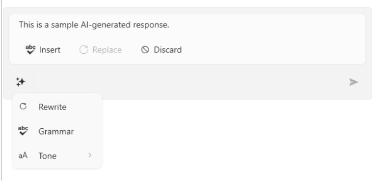

# Configuring Commands

`RadInlineAIAssistant` allows you to define a collection of predefined AI commands that end users can select from a dropdown, instead of (or in addition to) typing a free-form prompt.

## Populating the Commands Collection

The `Commands` property accepts an `ObservableCollection<InlineAIAssistantCommandBase>`. The commands button in the input area (see [Visual Structure]()) is visible only while this collection has items.

`InlineAIAssistantCommandBase` is the base class for the two supported item types and exposes:

* `Text`&mdash;The display text for the command. It is also used as the `Prompt` of the `PromptRequest` event when the command is selected.
* `Icon`&mdash;The icon representing the command. By default, the item template displays it through a `RadGlyph`, so set it to a glyph string value, such as one from the [Glyphs Reference Sheet](). If you need a different visual for the icon (for example, an `Image`), replace the item container style through `CommandsItemContainerStyleSelector`, described below.

### InlineAIAssistantCommand

A leaf command. Its `Command` property, if set, is an `ICommand` that is executed when the item is selected, in addition to `PromptRequest` being raised with the command's `Text` as the prompt.

### InlineAIAssistantCommandGroup

A command that displays its own `Commands` collection of `InlineAIAssistantCommand` items in a sub-menu flyout, letting you group related commands together (for example, a "Tone" group containing "Neutral", "Friendly", and "Formal").

__Defining a Commands collection with a leaf command and a group__
```C#
var glyphConverter = new StringToGlyphConverter();

this.assistant.Commands = new ObservableCollection<InlineAIAssistantCommandBase>
{
    new InlineAIAssistantCommand { Text = "Rewrite", Icon = glyphConverter.Convert("&#xe106;", null, null, null) },
    new InlineAIAssistantCommand { Text = "Grammar", Icon = glyphConverter.Convert("&#xe68d;", null, null, null) },
    new InlineAIAssistantCommandGroup
    {
        Text = "Tone",
        Icon = glyphConverter.Convert("&#xe607;", null, null, null),
        Commands = new List<InlineAIAssistantCommand>
        {
            new InlineAIAssistantCommand { Text = "Neutral" },
            new InlineAIAssistantCommand { Text = "Friendly" },
            new InlineAIAssistantCommand { Text = "Formal" },
        }
    },
};
```

>tip The `Icon` property expects a glyph value converted through `StringToGlyphConverter`. Check the [Glyphs Reference Sheet]() article for the full list of available glyphs and their string values.

__RadInlineAIAssistant with a Configured Commands Dropdown__



Selecting any leaf command (whether at the top level or inside a group) raises the `PromptRequest` event with the command's `Text` as the `Prompt`, exactly as if the end user had typed and submitted that text.

## Built-in Routed Commands

`RadInlineAIAssistantCommands` exposes the routed commands that back the control's built-in interactions:

* `Insert`&mdash;Inserts the response text at the caret position, through the current `InteractionProvider`. Its `CanExecute` state is driven by `InteractionProvider.CanInsertText`.
* `Replace`&mdash;Replaces the currently selected text with the response text, through the current `InteractionProvider`. Its `CanExecute` state is driven by `InteractionProvider.CanReplaceSelectedText`.
* `Discard`&mdash;Hides the response and closes the assistant.
* `ExecuteInlineCommand`&mdash;Executed when a `Commands` item is selected from the dropdown; raises `PromptRequest` with that item's `Text`.

These commands back the built-in __Insert__, __Replace__, and __Discard__ buttons in the response area described in [Handling Responses](), so you typically do not need to invoke them yourself.

## Customizing the Commands Item Style

The `CommandsItemContainerStyleSelector` property lets you provide a `StyleSelector` that chooses the container style applied to each `Commands` item. The built-in `InlineAIAssistantCommandsStyleSelector` selects between a style for `InlineAIAssistantCommand` items and one for `InlineAIAssistantCommandGroup` items, through its `CommandStyle` and `CommandGroupStyle` properties.

__Defining styles for the leaf commands and the command groups__
```XAML
<Window.Resources>
    <ResourceDictionary>
        <!-- you need the GenericWindows11.xaml only if you use the XAML version of the Telerik dlls -->
        <ResourceDictionary.MergedDictionaries>
            <ResourceDictionary Source="/Telerik.Windows.Controls.ConversationalUI;component/Themes/GenericWindows11.xaml" />
        </ResourceDictionary.MergedDictionaries>
        
        <Style x:Key="CommandItemStyle" TargetType="telerik:RadMenuItem" BasedOn="{StaticResource InlineAIAssistantCommandStyle}">
            <Setter Property="FontStyle" Value="Italic" />
        </Style>
        <Style x:Key="CommandGroupItemStyle" TargetType="telerik:RadMenuItem" BasedOn="{StaticResource InlineAIAssistantCommandGroupMenuItemStyle}">
            <Setter Property="FontWeight" Value="Bold" />
            <Setter Property="Foreground" Value="DarkBlue" />
        </Style>
    </ResourceDictionary>
</Window.Resources>
```

__Assigning the InlineAIAssistantCommandsStyleSelector__
```C#
this.assistant.CommandsItemContainerStyleSelector = new InlineAIAssistantCommandsStyleSelector
{
    CommandStyle = (Style)this.Resources["CommandItemStyle"],
    CommandGroupStyle = (Style)this.Resources["CommandGroupItemStyle"],
};
```

## See Also
* [Getting Started]()
* [Handling Responses]()
* [Events]()
