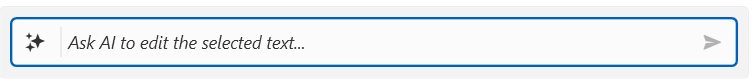
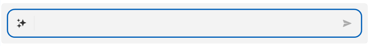

# Customizing Appearance

This article describes how to customize the appearance of `RadInlineAIAssistant`, beyond the standard `Background`, `BorderBrush`, `BorderThickness`, and `Padding` inherited from `Control`.

## Customizing the Watermark Content

The `WatermarkContent` property sets the content shown in the prompt input while it is empty, guiding the end user on what to type.

__Setting a custom watermark__
```C#
this.assistant.WatermarkContent = "Ask AI to edit the selected text...";
```

__RadInlineAIAssistant with a Customized Watermark Content__



<!-- TODO: attach screenshot showing the customized watermark content -->

## Customizing the Input Area

The `InputAreaBorderStyle` and `InputAreaPadding` properties control the border and the inner spacing of the input area that hosts the commands button and the prompt input (see [Visual Structure]()).

__Defining a custom input area border style__
```XAML
<Window.Resources>
    <Style x:Key="CustomInputAreaBorderStyle" TargetType="Border">
        <Setter Property="CornerRadius" Value="12" />
    </Style>
</Window.Resources>
```

__Customizing the input area border and padding__
```C#
this.assistant.InputAreaBorderStyle = (Style)this.Resources["CustomInputAreaBorderStyle"];
this.assistant.InputAreaPadding = new Thickness(8);
```

__RadInlineAIAssistant with a Customized Input Area__



## See Also
* [Handling Responses]()
* [Visual Structure]()

