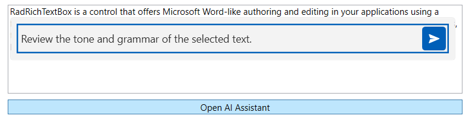
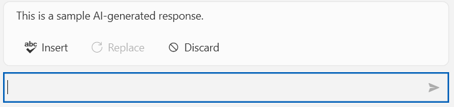

# Getting Started with WPF InlineAIAssistant

This tutorial will walk you through the creation of a sample application that contains a `RadInlineAIAssistant` control attached to a `TextBox`.

## Adding Telerik Assemblies Using NuGet

To use `RadInlineAIAssistant` when working with NuGet packages, install the `Telerik.Windows.Controls.ConversationalUI.for.Wpf.Xaml` package. The [package name may vary]() slightly based on the Telerik dlls set - [Xaml or NoXaml]()

Read more about NuGet installation in the [Installing UI for WPF from NuGet Package]() article.

### Adding Assembly References Manually

If you are not using NuGet packages, you can add a reference to the following assemblies:

* __Telerik.Licensing.Runtime__
* __Telerik.Windows.Controls__
* __Telerik.Windows.Controls.ConversationalUI__
* __Telerik.Windows.Controls.Input__
* __Telerik.Windows.Controls.Navigation__
* __Telerik.Windows.Data__

## Attaching the RadInlineAIAssistant to a TextBox

`RadInlineAIAssistant` does not need to be placed in the visual tree. Instead, you attach it to a target element (in this example, a `TextBox`) through the `InlineAIAssistant` attached property, and open it on demand by setting the `IsOpen` property.

__Defining a TextBox and a button that toggles the assistant__
```XAML
<StackPanel Margin="20">
    <TextBox x:Name="textBox" AcceptsReturn="True" TextWrapping="Wrap" Height="120"/>
    <Button Content="Open AI Assistant" Click="OnOpenAssistantButtonClick" Margin="0 8 0 0"/>
</StackPanel>
```

Before it can open, `RadInlineAIAssistant` needs an `InteractionProvider` that describes how it should read from and write to the target element. The control ships with a built-in provider for `TextBox`, called `InlineAIAssistantTextBoxProvider`. 

>tip To learn more about interaction providers, including the built-in `RadRichTextBox` provider and how to implement your own, check the [Configuring Interaction Providers]() article.

__Creating the RadInlineAIAssistant, setting its InteractionProvider, and attaching it to the TextBox__
```C#
private RadInlineAIAssistant assistant;

public MainPage()
{
    InitializeComponent();

    this.assistant = new RadInlineAIAssistant();
    this.assistant.InteractionProvider = new InlineAIAssistantTextBoxProvider(this.textBox);
    this.assistant.PromptRequest += this.OnPromptRequest;

    RadInlineAIAssistant.SetInlineAIAssistant(this.textBox, this.assistant);
}

private void OnOpenAssistantButtonClick(object sender, RoutedEventArgs e)
{
    this.assistant.IsOpen = !this.assistant.IsOpen;
}
```

The assistant also closes itself automatically: when the end user presses `Escape` while it has focus, clicks outside of it, or when the `TextBox` it is attached to is unloaded.

__RadInlineAIAssistant Opened next to a TextBox__



## Requesting a Response

When the end user submits the prompt input, `RadInlineAIAssistant` raises the `PromptRequest` event. In the handler, you contact your AI model and set the response back through the `InlineAIAssistantPromptRequestEventArgs.SetResponse` method.

__Handling the PromptRequest event__
```C#
private void OnPromptRequest(object sender, InlineAIAssistantPromptRequestEventArgs e)
{
    // Pass e.Prompt (and, optionally, e.SelectedText / e.FullText) to your AI model.
    e.SetResponse("This is a sample AI-generated response.");
}
```

Once a response is set, `RadInlineAIAssistant` displays it above the input area with __Insert__, __Replace__, and __Discard__ actions. To learn how to stream a response instead of setting it all at once, check the [Handling Responses]() article.

__RadInlineAIAssistant Displaying a Response__



## See Also
* [Visual Structure]()
* [Configuring Interaction Providers]()
* [Configuring Commands]()
* [Handling Responses]()
* [Events]()
