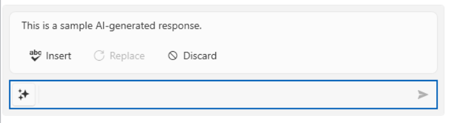
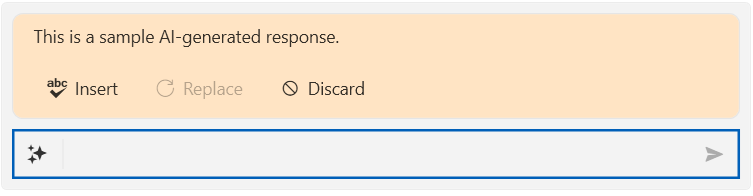

# Handling Responses

When the end user submits a prompt, `RadInlineAIAssistant` raises the `PromptRequest` event and waits for you to set a response through the `InlineAIAssistantPromptRequestEventArgs` passed to the handler.

## Setting an Immediate Response

Use `SetResponse(string)` to display a single response text as soon as it is available.

__Setting an immediate response__
```C#
private void OnPromptRequest(object sender, InlineAIAssistantPromptRequestEventArgs e)
{
    e.SetResponse("This is a sample AI-generated response.");
}
```

__RadInlineAIAssistant Displaying a Response__



## Streaming a Response

Use `SetResponse(IAsyncEnumerable<string>)` when your AI model streams its answer back in chunks. `RadInlineAIAssistant` awaits the sequence and appends each chunk to the displayed response text as it arrives, so the end user sees the response build up incrementally.

__Streaming a response__
```C#
private void OnPromptRequest(object sender, InlineAIAssistantPromptRequestEventArgs e)
{
    e.SetResponse(this.GetResponseStreamAsync(e.Prompt));
}

private async IAsyncEnumerable<string> GetResponseStreamAsync(string prompt)
{
    // Replace this with the streaming call to your AI model.
    yield return "This is ";
    await Task.Delay(200);
    yield return "a streamed ";
    await Task.Delay(200);
    yield return "AI-generated response.";
}
```

## Customizing How the Response Is Displayed

The response area is bound to the `ResponseViewModel` property, an `InlineAIAssistantResponseViewModel` exposing:

* `ResponseText`&mdash;The response text accumulated so far.
* `IsAIResponseVisible`&mdash;Whether the response area is visible. It is set to `true` automatically once the first chunk of a response arrives.

The `ResponseTemplate` property defines the `DataTemplate` used to render `ResponseViewModel`. By default, it displays an `InlineAIAssistantResponse` control, which shows the response text in a scrollable area (its height capped by the `ResponseMaxHeight` property of `RadInlineAIAssistant`) together with __Insert__, __Replace__, and __Discard__ buttons bound to the commands described in the [Configuring Commands]() article. You can replace `ResponseTemplate` to customize how the response is displayed.

__Defining a custom ResponseTemplate__
```XAML
<Window.Resources>
    <DataTemplate x:Key="CustomResponseTemplate">
        <telerikChat:InlineAIAssistantResponse ResponseText="{Binding ResponseText}" Background="Bisque"/>
    </DataTemplate>
</Window.Resources>
```

__Assigning the ResponseTemplate__
```C#
this.assistant.ResponseTemplate = (DataTemplate)this.Resources["CustomResponseTemplate"];
```



## Indicating Progress

You can manually set the `IsProcessing` property to `true` while your AI model call is in flight, and back to `false` once it completes, to reflect the busy state on the prompt input. This will change the current state of the send button.

## See Also
* [Configuring Commands]()
* [Events]()
* [Visual Structure]()
