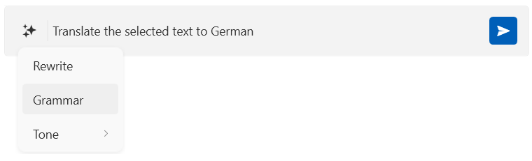

# WPF RadInlineAIAssistant Overview

The __RadInlineAIAssistant__ is a floating, popup-based control that attaches to a text control, such as a `TextBox` or a `RadRichTextBox`, and provides inline AI-powered text editing capabilities. It displays a prompt input together with a customizable dropdown of predefined commands (for example, rewrite, adjust tone, or translate), sends the request to your AI model, and shows the generated response with actions to insert or replace the affected text.





__RadInlineAIAssistant Overview__

>tip Get started with the control with its [Getting Started]() help article that shows how to use it in a basic scenario.

## Key Features

* __Attaching to a target element__&mdash;`RadInlineAIAssistant` attaches to a `FrameworkElement` (for example, a `TextBox`) through an attached property and opens as a floating popup positioned next to the caret or selection. Read more in the [Getting Started]() article.
* __Interaction providers__&mdash;The control talks to the target element through an `IInlineAssistantInteractionProvider` implementation. Built-in providers are available for `TextBox` and `RadRichTextBox`, and you can implement your own for other controls. Read more in the [Configuring Interaction Providers]() article.
* __Commands__&mdash;A `Commands` collection lets you populate a dropdown of predefined or custom AI actions, optionally grouped into sub-menus. Read more in the [Configuring Commands]() article.
* __Responses__&mdash;The control can display either an immediate or a streamed AI response, with built-in actions for inserting, replacing, or discarding it. Read more in the [Handling Responses]() article.
* __Appearance customization__&mdash;The input area border, padding, and watermark content can be customized. Read more in the [Customizing Appearance]() article.

> Check out the demos application at [demos.telerik.com](https://demos.telerik.com/wpf/).

## See Also
* [Visual Structure]()
* [Getting Started]()
* [Events]()
