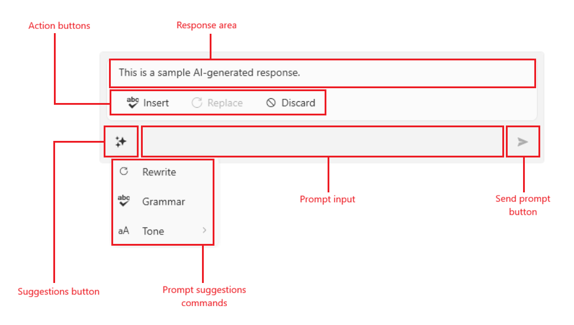

# Visual Structure

This section defines terms and concepts used in the scope of the `RadInlineAIAssistant` control, with which you have to get familiar before you continue to read its documentation. They can also be helpful when contacting our support service in order to describe your issue better.

`RadInlineAIAssistant` is hosted in its own popup and is made up of an input area and, once a response has been requested, a response area shown above it.

__RadInlineAIAssistant Visual Structure__

* __Suggestions button__&mdash;A button displayed at the start of the input area. It is visible only when the `Commands` collection has items, and clicking it opens a dropdown listing the configured commands/suggestions. Read more in the [Configuring Commands]() article.

* __Prompt input__&mdash;A text input where the end user types a custom request. Pressing its send action raises the `PromptRequest` event.

* __Response area__&mdash;Displayed above the input area once a response is available. 

* __Action buttons__&mdash; __Insert__, __Replace__, and __Discard__ buttons that act on the response.

* __Send prompt button__&mdash;Pressing the button sends action that raises the `PromptRequest` event.

* __Prompt suggestions commands__&mdash;User defined commands that allows you to setup a predefined prompt suggestions.

>tip Get started with the control with its [Getting Started]() help article that shows how to use it in a basic scenario.

## See Also
* [Getting Started]()
* [Handling Responses]()
