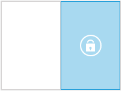

# Events

This article contains basic information about the events available with __RadLayoutControl__ and its components.

## RadLayoutControl events

The layout control has the following event.

* __SelectionChanged__: Occurs when the selection changes. The event arguments are of type __LayoutControlSelectionChangedEventArgs__  and have the following properties:
	
	* __NewItem__: A property of type __object__ that gets the selected item.
	* __OldItem__: A property of type __object__ that gets the previously selected item.
	* __AllowedActions__: A property of type __LayoutControlAllowedActions__ gets or sets the allowed operations for the selected item. 	
	
		> You can use this property to forbid specific input device (mouse, touch) interactions as drag, resize and the manipulation actions available in the [ManipulationPane]().
	
		The property is an enum and it has the following values:
		* __None__: No actions will be available 
		* __Resize__: Resize action will be available
		* __Drag__: Drag action will be available
		* __ManipulationPaneActions__: The manipulation pane will be available
		
		The default value of the __AllowedActions__ property is __Resize | Drag | ManipulationPaneActions__, which means that all actions are available. If the property is set to __None__, all actions are forbidden and a lock icon will be displayed over the selected item.
		
		__Example 1: Setting allowed actions__
		```C#
			private void LayoutControl_SelectionChanged(object sender, LayoutControlSelectionChangedEventArgs e)
			{
				e.AllowedActions = LayoutControlAllowedActions.None;                        
			}
		```

		#### __Figure 1: Locked item__
	

## Save/Load layout events

__RadLayoutControl__ and the [layout groups]() expose several events which can be used to modify the saving and loading process of the layout. The available events are listed below.

* __ElementSaving__
* __ElementSaved__
* __ElementLoading__
* __ElementLoaded__

> You can find more information about the events and customization of the layout saving/loading in the [Save/Load Layout]() help article.

## See Also  
* [Getting Started]()
* [Layout Groups Overview]()
* [Layout Panel]()
* [Visual Structure]()
