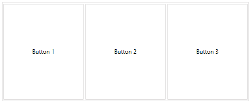
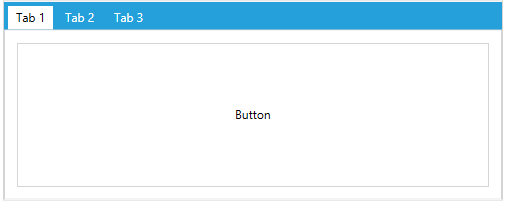

# Display Modes

__RadLayoutControl__ supports several display modes that defines how the __LayoutControlGroup__ should look. The mode is determined by the __DisplayMode__ property of the __LayoutControlGroup__ component. The property is an enumeration of type __LayoutControlGroupDisplayMode__ which exposes the following values:
* [LayoutPanel](#layoutpanel) (the default mode)
* [TabControl](#tabcontrol)
* [Expander](#expander)

#### __[XAML] Example 1: Setting the DisplayMode property__
{{region layoutcontrol-features-display-modes-01}}
	<telerik:LayoutControlGroup DisplayMode="TabControl" />
{{endregion}}

## LayoutPanel

When the __DisplayMode__ is set to __LayoutPanel__ the items in the group will be displayed in the default layout panel. No additional area for the group header will be added.

#### __Figure 1: LayoutPanel__

## TabControl

When the __DisplayMode__ is set to __TabControl__ the items in the group will be displayed in a tab control. An additiona header area is display at the top of the panel. Each child __LayoutControlGroup__ is placed in a new tab item which header content depends on the group's Header property.

#### __Figure 2: TabControl__

## Expander

When the __DisplayMode__ is set to __Expander__ the items in the group will be displayed in an expander. An additiona header area is display at the top of the panel.

#### __Figure 3: Expander__

You can control the expanding/collapsing of the group though the __IsExpanded__ and __IsExpandable__ properties of the control.  

* __IsExpandable__: A property of type __bool__ that gets or sets a value which indicates whether the layout group can be expanded/collapsed. When the property is set to False the expander icon will be hidden.
* __IsExpanded__: A property of type __bool__ that gets or sets a value which indicates whether the layout group is expanded.
 
> Those properties are taken into consideration only when the __DisplayMode__ is set to __Expander__.

## See Also
* [Overview]()
* [Getting Started]()
* [LayoutControlGroup]()