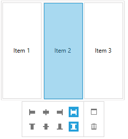
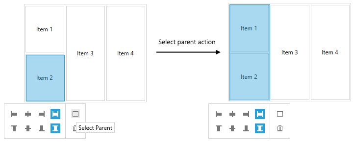
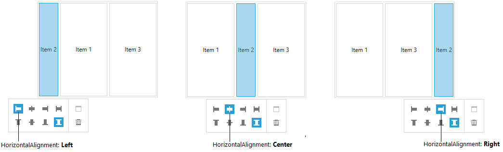
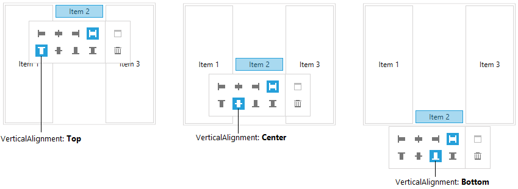
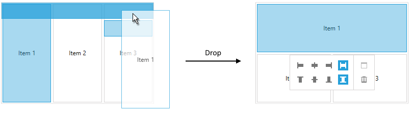
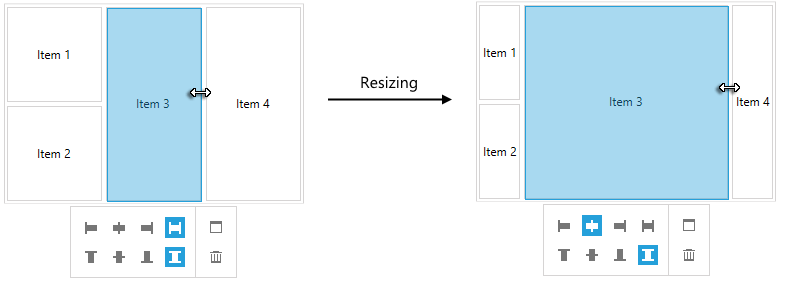

# Edit the Layout

* [Overview](#overview)
* [Manipulation Pane](#manipulation-pane)
* [Drag and Drop](#drag-and-drop)
* [Resizing](#resizing)

## Overview 

__RadLayoutControl__ supports rerranging and editing its layout at runtime. You can change the position, alignment and size of each LayoutControlGroup or UIElement that is direct child of a group or the control itself. Also, each group or UIElement can be removed from the layout. In order to do that the control should be in edit mode. This is done by setting the __IsInEditMode__ property of __RadLayoutControl__ to __True__.

#### __[XAML] Example 1: Setting IsInEditMode in XAML__
{{region layoutcontrol-features-edit-the-layout-01}}
	<telerik:RadLayoutControl x:Name="layoutControl" IsInEditMode="True" />
{{endregion}}

#### __[C#] Example 2: Setting IsInEditMode in code__
{{region layoutcontrol-getting-started-layoutpanel-02}}
	this.layoutControl.IsInEditMode = true;
{{endregion}}
	
Setting the property to True will allow you to select the visual elements and groups, and drag them around.

## Manipulation Pane

The manipulation pane allows control over the arrangement of the selected element. When the edit mode is enabled you can select the elements in the layout control. The pane will be displayed horizontally centered under the selected element.

#### __Figure 1: RadLayoutControl Manipulation Pane__

The following actions can be executed through the pane:

* __Delete__: The element is removed from the layout control.

* __Select Parent__: The selection is changed to the parent __LayoutControlGroup__. If there is no parent group, the selection won't be changed.
	
	#### __Figure 2: Selecting the parent group__
	
	
* You can define the __horizontal alignment__ of the selected element. There are the following options:
	* __Stretch__ (the default value): The element is horizontally stretched in the available space. __Example 1__ demonstrates stretch alignment.
	* __Center__: The element is centered horizontally in the available space.
	* __Left__: The element is horizontally left aligned in the available space.
	* __Right__: The element is horizontally right aligned in the available space.

	#### __Figure 3: The horizontal alignment options__
	
		
* You can define the __vertical alignment__ of the selected element. There are the following options:
	* __Stretch__ (the default value): The element is vertically stretched in the available space. __Example 1__ demonstrates stretch alignment.
	* __Center__: The element is centered vertically in the available space.
	* __Top__: The element is vertically left aligned in the available space.
	* __Bottom__: The element is vertically right aligned in the available space.

	#### __Figure 4: The vertical alignment options__
	

> The alignment options work with the __VerticalAlignment__ and __HorizontalAlignment__ properties of the selected component. By default the elements are vertically and horizontally stretched. Setting the alignment properties manually will affect the selected option in the manipulation pane.

<!-- -->

> You can read more about the ordering and alignment of the items in the layout control in the [Layout Panel]() help article.

## Drag and Drop

The drag and drop feature of the control gives you the ability to rearrange the elements in the layout. When an item is selected you can drag and drop it over another position. The allowed positions where the dragged item can be dropped are displayed with the [LayoutControlDropIndicator]() element.

#### __Figure 5: Dragging an element triggers the logic that displays the drop indicators.__

> Depending on the drop position the layout control can change a panel's orientation or include additional layout groups.

## Resizing

The items in the layout control can be resized by dragging their resize handles placed on their top, bottom, left and right borders. 

#### __Figure 6: Resizing__

Setting the __Height__ and __Width__ of the selected element (UIElement or LayoutControlGroup) will also resize it.

> The ManipulationPane of the control will always be horizontally aligned at the center of the selected element.

## See Also
* [Overview]()
* [Getting Started]()
* [Display Modes]()
* [Orientation]()
* [Edit the Layout]()
* [Layout Panel]()
* [Visual Structure]()