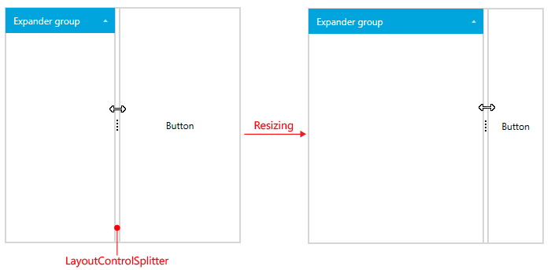
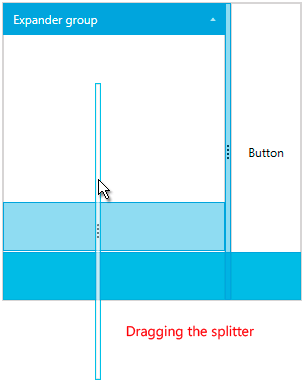

# Layout Splitter

The __LayoutControlSplitter__ component allows you to resize the elements in the layout at runtime when __RadLayoutControl__ is not in edit mode. The following examples show you how to define a splitter.

__Example 1: Defining the splitter in XAML__ 
```XAML
    <telerik:RadLayoutControl>
		<telerik:LayoutControlExpanderGroup Header="Expander group" />
		<telerik:LayoutControlSplitter />
		<Button Content="Button" />
	</telerik:RadLayoutControl>
```
	
__Example 2: Defining the splitter in code__  
```C#
	LayoutControlSplitter splitter = new LayoutControlSplitter();
	this.layoutControl.Items.Add(splitter);
```
```VB.NET
	Dim splitter As New LayoutControlSplitter()
	Me.layoutControl.Items.Add(splitter)
```

#### __Figure 1: LayoutControlSplitter__  


>important The element that will be resized with the splitter is determined by the Orientation of its parent group. When the orientation is Horizontal, the splitter will resize its left sibling element and when Vertical - the top sibling will be resized.

As any other UIElement the __LayoutControlSplitter__ element can be moved around in the layout control when in edit mode.

#### __Figure 2: Dragging the layout splitter while the layout control is in edit mode__  

	
## See Also
* [Getting Started]()
* [Edit the Layout]()
* [Layout Groups Overview]()
