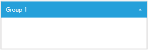
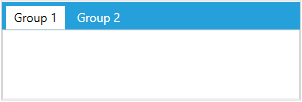

# LayoutControlGroup

This article describes the main features of __LayoutControlGroup__.

* [Overview](#overview)
* [Key Functionality](#key-functionality)
* [Properties](#properties)

## Overview

__LayoutControlGroup__ is the visual component that represents the groups in the layout control. The group is a headered items control so it can contain child elements which allows you to nest the components of the layout into one another. Additionally, each group can have a header that gives extra information about its purpose or content.

> __LayoutControlGroup__ derives from the __LayoutControlGroupBase__ class which is also the ancestor of the __RadLayoutControl__ itself. This means that they behave in similar manner. Regardless this fact the RadLayoutControl should always be the root element of the layout.

## Key Functionality

This section contains information of the main features provided by the LayoutControlGroup's API.

* __Display modes__: The __LayoutControlGroup__ supports several display modes that determine how the group will be visualized. You can change the mode using the DisplayMode property. You can see examples and find more about this in the [Display Modes]() help article.

* __Items orientation__: The layout groups allows you to change their orientation. You can do that through the __Orientation__ property. You can read more about this in the [Orientation]() help article.

## Properties

__LayoutControlGroup__ exposes the following properties.

* __Orientation__ A property of type __System.Windows.Orientation__ that gets a value which determines the orientation of the group's panel.

* __DisplayMode__: A property of type __LayoutControlGroupDisplayMode__ that gets or sets the value which determines the display of the group. 

* __Header__: A property of type __object__ that sets or gets the header of the group. The way this property affects the group's UI depends on the __DisplayMode__ applied.
	
	* __LayoutPanel__: No additional elements will be added to the group's panel and the header won't be displayed.
		
		#### __[XAML] Example 1: Setting the Header property. The DisplayMode is set to LayoutPanel by default.__	
		{{region layoutcontrol-features-layoutcontrolgroup-01}}
			<telerik:RadLayoutControl>          
				<telerik:LayoutControlGroup Header="Group 1" />
			</telerik:RadLayoutControl>
		{{endregion}}
		
		#### __Figure 1: Header applied when the DisplayMode is set to LayoutPanel__
		
	
	* __Expander__: The header will be displayed in a border placed at the top of the group.
	
		#### __[XAML] Example 2: Setting the Header property when the DisplayMode is set to Expander__
		{{region layoutcontrol-features-layoutcontrolgroup-01}}
			 <telerik:RadLayoutControl>          
				<telerik:LayoutControlGroup Header="Group 1" />
			</telerik:RadLayoutControl>
		{{endregion}}
			
		#### __Figure 2: Header applied when the DisplayMode is set to Expander__
		
		
	* __TabControl__:  The header will be displayed in the tab item.
	
		#### __[XAML] Example 3: Setting the Header property when the DisplayMode is set to TabControl__
		{{region layoutcontrol-features-layoutcontrolgroup-01}}
			<telerik:LayoutControlGroup>
				<telerik:LayoutControlGroup Header="Group 1" />	
				<telerik:LayoutControlGroup Header="Group 2" />	
			</telerik:LayoutControlGroup>
		{{endregion}}
			
		#### __Figure 3: Header applied when the DisplayMode is set to TabControl__
		

* __IsExpandable__: A property of type __bool__ that gets or sets a value which indicates if the LayoutControlGroup can be expanded with the arrow icon, when its __DisplayMode__ is set to __Expander__. When the property is set to False the expander arrow icon won't be displayed. 

* __IsExpanded__: A property of type __bool__ that gets or sets a value that indicates if the LayoutControlGroup is expanded when its __DisplayMode__ is set to __Expander__.

> The __IsExpandable__ and __IsExpanded__ properties are taken into consideration only when the __DisplayMode__ is set to __Expander__.

## See Also
* [Getting Started]()
* [Display Modes]()
* [Orientation]()
* [Edit the Layout]()