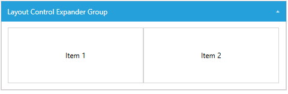
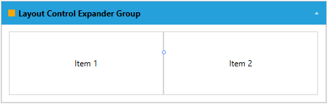
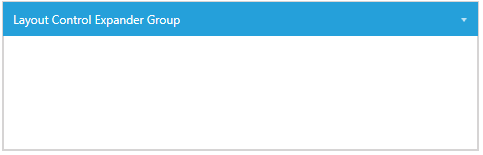
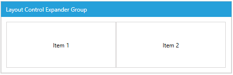

# LayoutControlExpanderGroup

__LayoutControlExpanderGroup__ is one of the few layout groups supported by the __RadLayoutControl__. __LayoutControlExpanderGroup__ behaves as the __LayoutControlGroup__ but its children are displayed in an __expander control__. Clicking on the group’s header or the expand arrow will expand or collapse its children.

> You can read the [Layout Panel]() article to get better understanding on how the layout groups are arranging their children. 

__Example 1: Setting up LayoutControlExpanderGroup__
```XAML
	<telerik:RadLayoutControl >            
		<telerik:LayoutControlExpanderGroup Header="Layout Control Expander Group">                    
			<Button Content="Item 1" />
			<Button Content="Item 2" />
		</telerik:LayoutControlExpanderGroup>            
	</telerik:RadLayoutControl>  
```

#### __Figure 1: LayoutControlExpanderGroup__


The header of the expander group can be set through its __Header__ property. The property is of type __Object__ which allows you to place any visual (or not) element in it.

__Example 2: Setting up the header of LayoutControlExpanderGroup__
```XAML
	<telerik:RadLayoutControl>            
		<telerik:LayoutControlExpanderGroup>
			<telerik:LayoutControlExpanderGroup.Header>
				<StackPanel Orientation="Horizontal">
					<Rectangle Width="10" Height="10" Fill="Orange" Margin="0 0 5 0" />
					<TextBlock Text="Layout Control Expander Group" FontWeight="Bold" />
				</StackPanel>
			</telerik:LayoutControlExpanderGroup.Header>
			<Button Content="Item 1" />
			<Button Content="Item 2" />
		</telerik:LayoutControlExpanderGroup>            
	</telerik:RadLayoutControl>   
```	

#### __Figure 2: LayoutControlExpanderGroup with UIElements in its header__


The group’s content state (collapsed/expanded) can be manually controlled via the __IsExpanded__ property. 

__Example 3: Setting the state of LayoutControlExpanderGroup__
```XAML
	<telerik:LayoutControlExpanderGroup IsExpanded="False">
```
	
#### __Figure 3: Collapsed LayoutControlExpanderGroup__


> You can notice that the size of the group demonstrated in __Figure 3__ and __Example 3__ doesn't collapse, but only its children are hidden (collapsed). This is because the group's __VerticalAlignment__ is set to __Stretch__ by default. In this example, if you want to collapse also the size of the group itself you can set the __VerticalAlignment__ to __Top__.

The __IsExpandable__ property of LayoutControlExpanderGroup controls whether the expanding arrow should be displayed and the collapse/expand action can be executed by clicking on the header.
	
__Example 4: Setting the IsExpandable property of LayoutControlExpanderGroup__
```XAML
	<telerik:LayoutControlExpanderGroup IsExpandable="False">
```

#### __Figure 4: LayoutControlExpanderGroup with disabled collapse/expand interactions__


> When the __IsExpandable__ property is set to __False__ the content of the group can still be collapsed and expanded via the __IsExpanded__ property.

<!-- -->

> When no explicit dimensions are set the size of the group depends on its position in the layout and also its alignment. When a group is collapsed it is not necessary that its size collapses too. This depends on its size and alignment.

## See Also
* [Getting Started]()
* [Layout Groups Overview]()
* [LayoutControlGroup]()
* [LayoutControlTabGroup]()