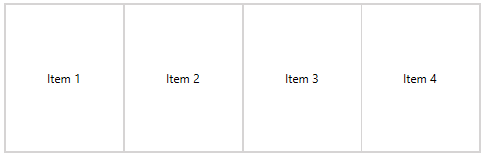
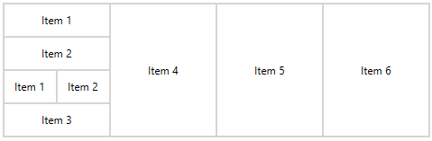

# LayoutControlGroup

__LayoutControlGroup__ is one of the few layout groups supported by the __RadLayoutControl__. When it comes to visual appearance __LayoutControlGroup__ is the most simple of the groups. It displays only a border around its items. 

> You can read the [Layout Panel]() article to get better understanding on how the layout groups are arranging their children. 

__Figure 1__ shows how a LayoutControlGroup with few children looks. And __Example 1__ demonstrates how to set up a group.

__Example 1: Setting up LayoutControlGroup__
```XAML
	<telerik:RadLayoutControl>            
		<telerik:LayoutControlGroup >                
			<Button Content="Item 1" />
			<Button Content="Item 2" />
			<Button Content="Item 3" />
			<Button Content="Item 4" />
		</telerik:LayoutControlGroup>
	</telerik:RadLayoutControl>      
```	

#### __Figure 1: LayoutControlGroup__


You can add __LayoutControlGroup__ into another layout group (see __Example 2__).

__Example 2: Nesting LayoutControlGroups__
```XAML
	<telerik:RadLayoutControl>
		<telerik:LayoutControlGroup>
			<telerik:LayoutControlGroup Orientation="Vertical">                    
				<Button Content="Item 1" />
				<Button Content="Item 2" />
				<telerik:LayoutControlGroup>
					<Button Content="Item 1" />
					<Button Content="Item 2" />
				</telerik:LayoutControlGroup>
				<Button Content="Item 3" />
			</telerik:LayoutControlGroup>
			<Button Content="Item 4" />
			<Button Content="Item 5" />
			<Button Content="Item 6" />
		</telerik:LayoutControlGroup>
	</telerik:RadLayoutControl>
```    

#### __Figure 2: Nested LayoutControlGroups__
	

## See Also
* [Getting Started]()
* [Layout Groups Overview]()
* [LayoutControlTabGroup]()
* [LayoutControlExpanderGroup]()