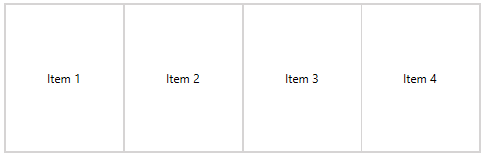
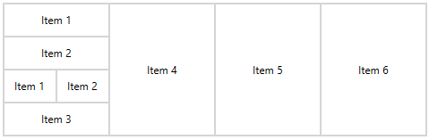

# LayoutControlGroup

__LayoutControlGroup__ is one of the few layout groups supported by the __RadLayoutControl__. When it comes to visual appearance __LayoutControlGroup__ is the most simple of the groups. It displays only a border around its items. 

> You can read the [Layout Panel]() article to get better understanding on how the layout groups are arranging their children. 

__Figure 1__ shows how a LayoutControlGroup with few children looks. And __Example 1__ demonstrates how to set up a group.

__Example 1: Setting up LayoutControlGroup__
<snippet id='radlayoutcontrol-features-layoutgroups-layoutcontrolgroup-example_1_setting_up_layoutcontrolgroup-xaml' />

#### __Figure 1: LayoutControlGroup__

You can add __LayoutControlGroup__ into another layout group (see __Example 2__).

__Example 2: Nesting LayoutControlGroups__
<snippet id='radlayoutcontrol-features-layoutgroups-layoutcontrolgroup-example_2_nesting_layoutcontrolgroups-xaml' />

#### __Figure 2: Nested LayoutControlGroups__
	

## See Also
* [Getting Started]()
* [Layout Groups Overview]()
* [LayoutControlTabGroup]()
* [LayoutControlExpanderGroup]()