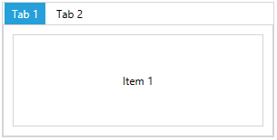
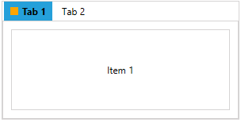
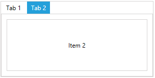

# LayoutControlTabGroup

__LayoutControlTabGroup__ is one of the few layout groups supported by the __RadLayoutControl__. __LayoutControlTabGroup__ behaves a little differently than the other types of groups. Basically, it its children are displayed in a __tab control__ and each tab item is represented by a __LayoutControlTabGroupItem__ element.

__Example 1: Setting up LayoutControlTabGroup__
```XAML
	<telerik:RadLayoutControl>	
		<telerik:LayoutControlTabGroup>
			<telerik:LayoutControlTabGroupItem Header="Tab 1">
				<Button Content="Item 1" />                    
			</telerik:LayoutControlTabGroupItem>
			<telerik:LayoutControlTabGroupItem Header="Tab 2">
				<Button Content="Item 2" />
			</telerik:LayoutControlTabGroupItem>                
		</telerik:LayoutControlTabGroup>	
	</telerik:RadLayoutControl>
```
	
#### __Figure 1: LayoutControlTabGroup__


> If a UIElement is added as a direct child of a tab group, it will be automatically wrapped into a __LayoutControlTabGroupItem__.

The header of the tab group item can be set through its __Header__ property. The property is of type __Object__ which allows you to place any visual (or not) element in it.

__Example 2:  Setting up the header of LayoutControlTabGroupItem__
```XAML
	<telerik:RadLayoutControl>	
		<telerik:LayoutControlTabGroup>
			<telerik:LayoutControlTabGroupItem>
				<telerik:LayoutControlTabGroupItem.Header>
					<StackPanel Orientation="Horizontal">
						<Rectangle Width="10" Height="10" Fill="Orange" Margin="0 0 5 0" />
						<TextBlock Text="Tab 1" FontWeight="Bold" />
					</StackPanel>
				</telerik:LayoutControlTabGroupItem.Header>
				<Button Content="Item 1" />                    
			</telerik:LayoutControlTabGroupItem>
			<telerik:LayoutControlTabGroupItem Header="Tab 2" />
		</telerik:LayoutControlTabGroup>	
	</telerik:RadLayoutControl>
```	

#### __Figure 2: LayoutControlExpanderGroup with UIElements in its header__


> __LayoutControlTabGroupItem__ is also a layout group control which means that you can move and arrange it in the layout. In other words the item can be dragged outside of the tab control group. Also, you can drag an element from the layout and place it in the tab strip area which will automatically wrap it into a LayoutControlTabGroupItem.

## Selection

The tab group allows you to select its child tab items. The selection can be change through the __SelectedItem__ property of __LayoutControlTabGroup__ or the __IsSelected__ property __LayoutControlTabGroupItem__.

__Example 3: Setting up the selection in LayoutControlTabGroup__
```XAML
	<telerik:RadLayoutControl>	
		<telerik:LayoutControlTabGroup>
			<telerik:LayoutControlTabGroupItem Header="Tab 1">
				<Button Content="Item 1" />                    
			</telerik:LayoutControlTabGroupItem>
			<telerik:LayoutControlTabGroupItem Header="Tab 2" IsSelected="True">
				<Button Content="Item 2" />
			</telerik:LayoutControlTabGroupItem>                
		</telerik:LayoutControlTabGroup>	
	</telerik:RadLayoutControl>       
```

#### __Figure 3: LayoutControlTabGroupItem selection__


## See Also
* [Getting Started]()
* [Layout Groups Overview]()
* [LayoutControlGroup]()
* [LayoutControlExpanderGroup]()