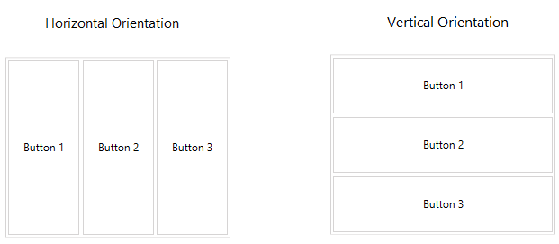

# Orientation

__RadLayoutControl__ and _the _layout groups__ are ordering their children with a horizontal orientation by default. You can change this and arrange the child items in a vertical order by setting the control's __Orientation__ property to Vertical. 

The property is an enumeration of type __System.Windows.Controls.Orientation__ and exposes the following values:
* __Horizontal__: The layout will be oriented horizontally.
* __Vertical__: The layout will be oriented vertically.

__Example 1: Setting the Orientation property of RadLayoutControl__
```XAML
	<telerik:RadLayoutControl Orientation="Vertical"/>
```
	
__Example 2: Setting the Orientation property of LayoutControlGroup__
```XAML
	<telerik:LayoutControlGroup Orientation="Vertical"/>
```

#### __Figure 1: Horizontal and Vertical orientations__  

		
> The __Orientation__ property doesn't affect the __LayoutControlTabGroup__.
	
## See Also
* [Getting Started]()
* [Edit the Layout]()
* [Layout Groups Overview]()
