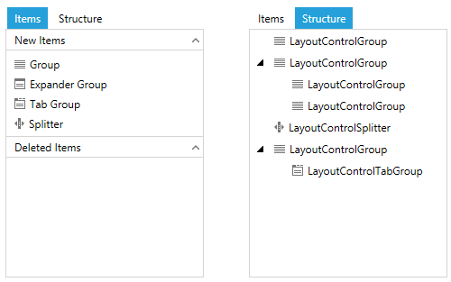

# ToolBox Overview

The layout control toolbox allows you to add items in the layout control at runtime by drag&drop and also gives you access to the history of the deleted items.

>important The drag/drop operation from the toolbox to the layout control will be allowed only if the layout control is in [edit mode]().

## Structure

#### __Figure 1: LayoutControlToolBoxView__

The toolbox has a few sections containing information about the available items (__New Items__), the deleted items (__Deleted Items__) and the structure of the elements in the layout.

The __New Items__ section of the Items tab displays a list of elements that can be added into the layout control.

The __Deleted Items__ of the Items section displays all the elements that have been deleted, and also allows you to drag them back into the layout control. The deleted items feature is disabled by default. To enable it you can use the __TrackDeletedItems__ property of __LayoutControlToolBoxView__.

The __Structure__ tab displays a hierarchical structure of the layout, allowing easy navigation between the parent and child elements. Selecting an item from the tree will select it in the layout control as well.

## Setting up the toolbox

The layout control toolbox is presented via the __LayoutControlToolBoxView__ control which you can display following the approaches listed below.

* [Using the LayoutControlToolBox control](): You can define the control in the __AdditionalCanvasItems__ collection of __RadLayoutControl__. This will embed a toggle button into the layout control allowing you to show and hide the __LayoutControlToolBoxView__.

* [Using the LayoutControlToolBoxView control](): You can place the control anywhere in the view, thus giving you flexibility when it comes to arrangement.

## See Also
* [Getting Started]()
* [Visual Structure]()
* [Layout Groups Overview]()
* [Edit the Layout]()
* [Layout Panel]()
