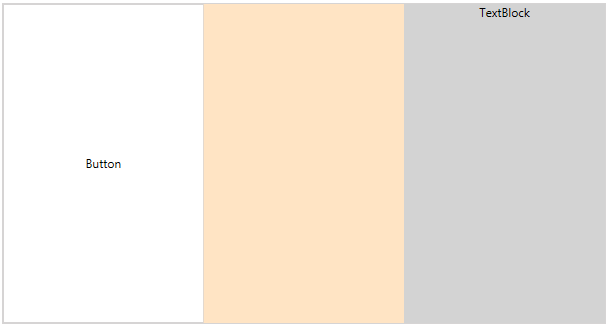
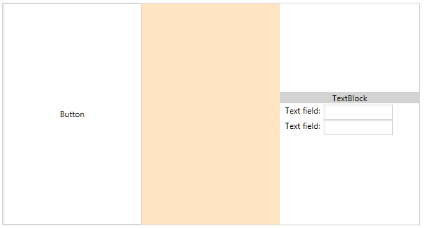
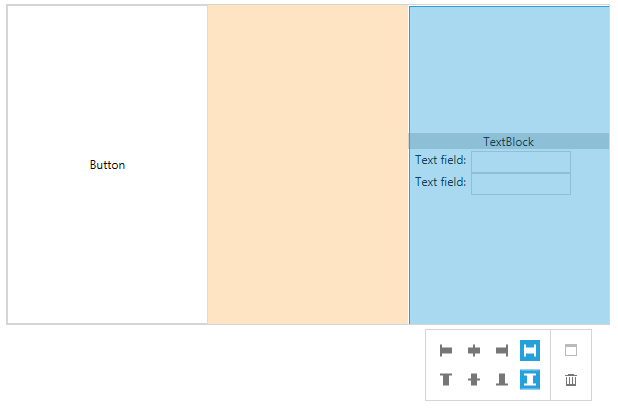
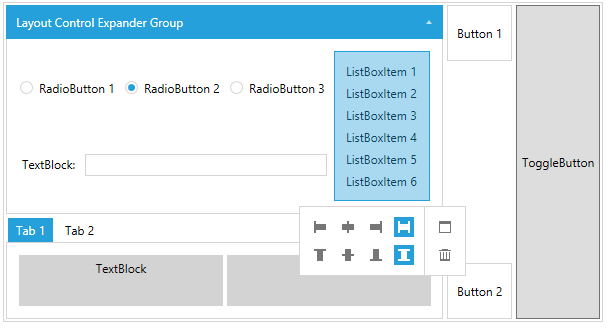

# Getting Started with {{ site.framework_name }} LayoutControl

This tutorial will walk you through the creation of a sample application that contains __RadLayoutControl__.

* [Assembly References](#assembly-references)
* [Defining a RadLayoutControl](#defining-a-radlayoutcontrol)
* [Adding Items in the Control](#adding-items-in-the-control)
* [Layout Groups](#layout-groups)
* [Enable Edit Mode](#enable-edit-mode)
* [Code Example](#code-example)

> The figures in the RadLayoutControl help documentation are showing the control with the __Windows8 theme__ applied. You can see how to set a theme in the [Setting a Theme]() help article.

## Adding Telerik Assemblies Using NuGet

To use __RadLayoutControl__ when working with NuGet packages, install the `Telerik.Windows.Controls.Navigation.for.Wpf.Xaml` package. The [package name may vary]() slightly based on the Telerik dlls set - [Xaml or NoXaml]()

Read more about NuGet installation in the [Installing UI for WPF from NuGet Package]() article.

>tip With the 2025 Q1 release, the Telerik UI for WPF has a new licensing mechanism. You can learn more about it [here]().

## Adding Assembly References Manually

If you are not using NuGet packages, you can add a reference to the following assemblies:

* __Telerik.Licensing.Runtime__
* __Telerik.Windows.Controls__
* __Telerik.Windows.Controls.Navigation__

You can find a list with the required assemblies for each control from the UI for WPF suite in the [Controls Dependencies]() help article.

## Defining a RadLayoutControl

You can add __RadLayoutControl__ manually in XAML as demonstrated in __Example 1__. 

#### __[XAML] Example 1: Adding RadLayoutControl in XAML__
{{region layoutcontrol-getting-started-01}}
	<telerik:RadLayoutControl />
{{endregion}}
	
__RadLayoutControl__ doesn't display any content when it is not populated with items or layout groups, so at this point only the border of the control should be displayed on the screen.

#### __Figure 1: Empty RadLayoutControl__

## Adding Items in the Control

You can add items through the __Items__ collection of RadLayoutControl. The layout component works with __LayoutControlGroup__ controls and __UIElements__. In other words you can populate it with all visual elements provided by the framework. __Example 2__ demonstrates this.

#### __[XAML] Example 2: Adding items in the RadLayoutControl.__
{{region layoutcontrol-getting-started-02}}
	<telerik:RadLayoutControl>           
		<Button Content="Button"/>
		<Border Background="Bisque"/>
		<telerik:LayoutControlGroup>
			<TextBlock Text="TextBlock" Background="LightGray" TextAlignment="Center"/>
		</telerik:LayoutControlGroup>
	</telerik:RadLayoutControl>
{{endregion}}

#### __Figure 2: RadLayoutControl with few elements added__

> By default the layout control and its groups are ordering their items with __horizontal orientation__. You can see how to change this in the [Orientation]() help article.

You can nest LayoutControlGroups into one another which allows you to separate the layout into different groups that can be arranged along with their items.

#### __[XAML] Example 3: Nesting LayoutControlGroups__
{{region layoutcontrol-getting-started-03}}
	<telerik:RadLayoutControl>           
		<Button Content="Button"/>
		<Border Background="Bisque"/>
		<telerik:LayoutControlGroup Orientation="Vertical">
			<TextBlock Text="TextBlock" Background="LightGray" TextAlignment="Center" VerticalAlignment="Center"/>
			<telerik:LayoutControlGroup Orientation="Vertical" VerticalAlignment="Center" Margin="2">
				<StackPanel Orientation="Horizontal">
					<TextBlock Text="Text field:" Margin="5 0 5 0" />
					<TextBox MinWidth="100"/>
				</StackPanel>
				<StackPanel Orientation="Horizontal">
					<TextBlock Text="Text field:" Margin="5 0 5 0" />
					<TextBox MinWidth="100"/>
				</StackPanel>
			</telerik:LayoutControlGroup>
		</telerik:LayoutControlGroup>
	</telerik:RadLayoutControl>
{{endregion}}

#### __Figure 3: RadLayoutControl with nested groups__

>important RadLayoutControl doesn't support data binding and setting its ItemsSource property will throw an exception (NotSupportedException).

## Layout Groups

There are few layout group controls which can be used with __RadLayoutControl__. Each group has different appearance. You can read more about this in the [Layout Groups]() section in the documentation. Additionally, the [Code Example](#code-example) section of this help article demonstrates the different layout groups.

## ScrollViewer Root Element

The RadLayoutControl and its groups wrap their content in a ScrollViewer. The ScrollViewer control measures its children with infinity. This behavior disables the virtualization of all controls placed inside. You can easily disable the ScrollViewer functionality and delegate the scrolling to the child framework element inside. To do that you can set the __ScrollViewer.VerticalScrollBarVisibility__ / __ScrollViewer.HorizontalScrollBarVisibility__ attached properties to the RadLayoutControl and to the groups you want this property applied.

## Enable Edit Mode

The control allows you to rearrange its children at runtime. To enable this the __IsInEditMode__ property of the control should be set to __True__.

#### __[XAML] Example 4: Enabling the edit mode of the control__
{{region layoutcontrol-getting-started-04}}
	<telerik:RadLayoutControl IsInEditMode="True" />
{{endregion}}
	
#### __Figure 4: The layout setup from Example 3 with one of the groups selected.__

> Read more about the edit mode in the [Edit the Layout]() article.

## Code Example

This section demonstrates a basic layout set up with nested groups and different group types.

#### __[XAML] Example 5: Complete code example__
{{region layoutcontrol-getting-started-05}}
	<telerik:RadLayoutControl IsInEditMode="True">
		<telerik:LayoutControlGroup Orientation="Vertical">
			<telerik:LayoutControlExpanderGroup Margin="2" Header="Layout Control Expander Group">
				<telerik:LayoutControlGroup Orientation="Vertical">
					<telerik:LayoutControlGroup>
						<RadioButton Content="RadioButton 1" Padding="5" VerticalAlignment="Center" Margin="2" />
						<RadioButton Content="RadioButton 2" IsChecked="True" Padding="5" VerticalAlignment="Center" Margin="2" />
						<RadioButton Content="RadioButton 3" Padding="5" VerticalAlignment="Center" Margin="2" />
					</telerik:LayoutControlGroup>

					<Grid>
						<Grid.ColumnDefinitions>
							<ColumnDefinition Width="Auto" />
							<ColumnDefinition />
						</Grid.ColumnDefinitions>
						<TextBlock Text="TextBlock:" Foreground="Black" VerticalAlignment="Center" Margin="5 0 5 0"/>
						<TextBox Grid.Column="1" Foreground="Black" VerticalAlignment="Center" Margin="5 0 5 0"/>
					</Grid>
				</telerik:LayoutControlGroup>

				<ListBox  Padding="8" Margin="2" >
					<ListBoxItem Content="ListBoxItem 1" />
					<ListBoxItem Content="ListBoxItem 2" />
					<ListBoxItem Content="ListBoxItem 3" />
					<ListBoxItem Content="ListBoxItem 4" />
					<ListBoxItem Content="ListBoxItem 5" />
					<ListBoxItem Content="ListBoxItem 6" />
				</ListBox>
			</telerik:LayoutControlExpanderGroup>

			<telerik:LayoutControlTabGroup Margin="2">
				<telerik:LayoutControlTabGroupItem Header="Tab 1">
					<telerik:LayoutControlGroup>
						<TextBlock Text="TextBlock" Padding="5" Margin="2" Foreground="Black" Background="LightGray" TextAlignment="Center" VerticalAlignment="Stretch" />
						<TextBlock Text="TextBlock" Padding="5" Margin="2" Foreground="Black" Background="LightGray" TextAlignment="Center" VerticalAlignment="Stretch" />
					</telerik:LayoutControlGroup>
				</telerik:LayoutControlTabGroupItem>
				<telerik:LayoutControlTabGroupItem Header="Tab 2" />
			</telerik:LayoutControlTabGroup>
		</telerik:LayoutControlGroup>

		<telerik:LayoutControlGroup Orientation="Vertical" HorizontalAlignment="Right">
			<Button Content="Button 1" Padding="10 20 10 20" Margin="2" VerticalAlignment="Top" />
			<Button Content="Button 2" Padding="10 20 10 20" Margin="2" VerticalAlignment="Bottom" />
		</telerik:LayoutControlGroup>

		<ToggleButton Content="ToggleButton" Padding="5 0 5 0" HorizontalAlignment="Right" Margin="2" />
	</telerik:RadLayoutControl>
{{endregion}}

#### __Figure 5: RadLayoutPanel example__  

> You can switch between normal and edit mode of the control by setting its __IsInEditMode__ property.

## Setting a Theme

The controls from our suite support different themes. You can see how to apply a theme different than the default one in the [Setting a Theme]() help article.

>important Changing the theme using implicit styles will affect all controls that have styles defined in the merged resource dictionaries. This is applicable only for the controls in the scope in which the resources are merged. 

To change the theme, you can follow the steps below:

* Choose between the themes and add reference to the corresponding theme assembly (ex: **Telerik.Windows.Themes.Windows8.dll**). You can see the different themes applied in the **Theming** examples from our [WPF Controls Examples](https://demos.telerik.com/wpf/) application.

* Merge the ResourceDictionaries with the namespace required for the controls that you are using from the theme assembly. For the __RadLayoutControl__, you will need to merge the following resources:

	* __Telerik.Windows.Controls__
	* __Telerik.Windows.Controls.Navigation__

__Example 6__ demonstrates how to merge the ResourceDictionaries so that they are applied globally for the entire application.

#### __[XAML] Example 6: Merge the ResourceDictionaries__  
{{region radlayoutcontrol-getting-started_6}}
	<Application.Resources>
		<ResourceDictionary>
			<ResourceDictionary.MergedDictionaries>
				<ResourceDictionary Source="/Telerik.Windows.Themes.Windows8;component/Themes/System.Windows.xaml"/>
				<ResourceDictionary Source="/Telerik.Windows.Themes.Windows8;component/Themes/Telerik.Windows.Controls.xaml"/>
				<ResourceDictionary Source="/Telerik.Windows.Themes.Windows8;component/Themes/Telerik.Windows.Controls.Navigation.xaml"/>
			</ResourceDictionary.MergedDictionaries>
		</ResourceDictionary>
	</Application.Resources>
{{endregion}}

>Alternatively, you can use the theme of the control via the [StyleManager](https://docs.telerik.com/devtools/wpf/styling-and-appearance/stylemanager/common-styling-apperance-setting-theme-wpf)[StyleManager](https://docs.telerik.com/devtools/silverlight/styling-and-appearance/stylemanager/common-styling-apperance-setting-theme).

__Figure 7__ shows a __RadLayoutControl__ with the **Windows8** theme applied.

#### __Figure 7: RadLayoutControl with the Windows8 theme__


## Telerik UI for WPF Learning Resources

* [Telerik UI for WPF LayoutControl Component](https://www.telerik.com/products/wpf/layoutcontrol.aspx)
* [Getting Started with Telerik UI for WPF Components]()
* [Telerik UI for WPF Installation]()
* [Telerik UI for WPF and WinForms Integration]()
* [Telerik UI for WPF Visual Studio Templates]()
* [Setting a Theme with Telerik UI for WPF]()
* [Telerik UI for WPF Virtual Classroom (Training Courses for Registered Users)](https://learn.telerik.com/learn/course/external/view/elearning/16/telerik-ui-for-wpf) 
* [Telerik UI for WPF License Agreement](https://www.telerik.com/purchase/license-agreement/wpf-dlw-s)


## See Also
* [Overview]()
* [Layout Groups]()
* [Layout Panel]()
* [Orientation]()
* [Edit the Layout]()
