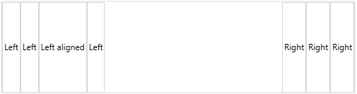
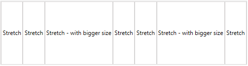
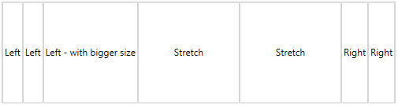
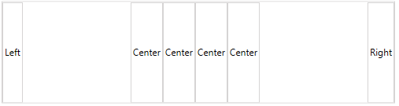
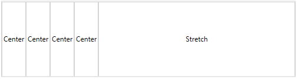
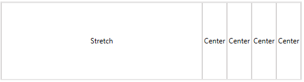
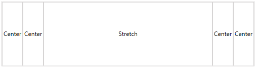
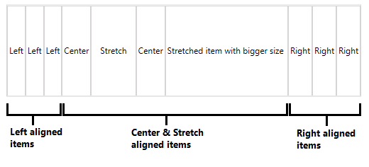

# Layout Panel

The purpose of this article is to describe how the __RadLayoutControl__ children are arranged in their panel.

The items panel of __RadLayoutControl__ and the __layout groups__ is a __LayoutPanel__. So, each group arranges its children in its available space using the same logic. This is why this article won't consider a scenario with nested groups but it will explain the arrangment only in a single panel with its Orientation set to Horizontal. The same principles apply in a vertically oriented panel.

> This article is not relevant for the __LayoutControlTabGroup__. The tab items of the group are always arranged horizontally.

The following rules apply to the children of the __LayoutPanel__ with a __horizontal orientation__:

* All __left aligned__ items will be stacked at the left side of the panel. The panel will give each item only as much size as it needs.

* All __right aligned__ items will be stacked at the right side of the panel. The panel will give each item only as much size as it needs.

	#### __Figure 1: Left and right aligned items__
	  
	Example 1 demonstrates the items setup demonstrated in __Figure 1__.	
	
* After positioning the left and right aligned elements the panel will divide the remaining space between the __stretched__ items. The positions of the stretched items varies based on the left/right and the center aligned items, and also on the index  of the item in the panel's children collection.

	#### __Figure 2: Stretched items with different sizes__  
	  
	Example 2 demonstrates the items setup demonstrated in __Figure 2__.	
	
	#### __Figure 3: Stretched and left/rigth aligned items with different sizes__  
	  
	Example 3 demonstrates the items setup demonstrated in __Figure 3__.	

* All __center aligned__ items will be stacked in the center of the panel's available space. 
	
	#### __Figure 4: Centered items__  
	  
	Example 4 demonstrates the items setup demonstrated in __Figure 4__.	
	
	#### __Figure 5: Centered and left/right aligned items__  
	  
	Example 5 demonstrates the items setup demonstrated in __Figure 5__.	
	
	In case there are stretched items in the panel, the center items might look like they are stacked left or right. The positions of the centered items will depend on the collection index of the stretched items.
	
	#### __Figure 6: Centered items and a single stretched item inserted at the end of the children collection__  
	  
	Example 6 demonstrates the items setup demonstrated in __Figure 6__.	
	
	#### __Figure 7: Centered items and a single stretched item inserted at the beginning of the children collection__  
	  
	Example 7 demonstrates the items setup demonstrated in __Figure 7__.	
	
	#### __Figure 8: Centered items and a single stretched item inserted around the middle of the children collection__  
	  
	Example 8 demonstrates the items setup demonstrated in __Figure 8__.	
	
	#### __Figure 9: Centered, stretched and left/right aligned items__  
	  
	Example 9 demonstrates the items setup demonstrated in __Figure 9__.	

In summary, the panel allocates space for the left and right aligned items first. Then the available space that is left is given to the center aligned and the stretched items.
	
> The order of the children in the LayoutPanel depends on their alignment and also their collection index.

<!-- -->

> The same rules are valid for a LayoutPanel with __vertical orientation__.

## Code Examples

This section contains the items setup demonstrated in the images in the article.

__Example 1: Left and right aligned items__ 
```XAML
	<telerik:RadLayoutControl>
		<Button Content="Left" HorizontalAlignment="Left" />
		<Button Content="Left" HorizontalAlignment="Left" />
		<Button Content="Left" HorizontalAlignment="Left" />
		<Button Content="Left aligned" HorizontalAlignment="Left" />
		<Button Content="Right" HorizontalAlignment="Right" />
		<Button Content="Right" HorizontalAlignment="Right" />
		<Button Content="Right" HorizontalAlignment="Right" />
	</telerik:RadLayoutControl>
```

__Example 2: Stretched items with different sizes__
```XAML
	<telerik:RadLayoutControl>
		<Button Content="Stretch" HorizontalAlignment="Stretch" />
		<Button Content="Stretch" HorizontalAlignment="Stretch" />
		<Button Content="Stretch - with bigger size" HorizontalAlignment="Stretch" />
		<Button Content="Stretch" HorizontalAlignment="Stretch" />
		<Button Content="Stretch" HorizontalAlignment="Stretch" />
		<Button Content="Stretch - with bigger size" HorizontalAlignment="Stretch" />
		<Button Content="Stretch" HorizontalAlignment="Stretch" />
	</telerik:RadLayoutControl>
```

__Example 3: Stretched and left/rigth aligned items with different sizes__ 
```XAML
	<telerik:RadLayoutControl>
		<Button Content="Left" HorizontalAlignment="Left" />
		<Button Content="Left" HorizontalAlignment="Left" />
		<Button Content="Left - with bigger size" HorizontalAlignment="Left" />
		<Button Content="Stretch" HorizontalAlignment="Stretch" />
		<Button Content="Stretch" HorizontalAlignment="Stretch" />
		<Button Content="Right" HorizontalAlignment="Right" />
		<Button Content="Right" HorizontalAlignment="Right" />
	</telerik:RadLayoutControl>
```

__Example 4: Centered items__ 
```XAML
	<telerik:RadLayoutControl>
		<Button Content="Center" HorizontalAlignment="Center" />
		<Button Content="Center" HorizontalAlignment="Center" />
		<Button Content="Center" HorizontalAlignment="Center" />
		<Button Content="Center" HorizontalAlignment="Center" />
	</telerik:RadLayoutControl>
```

__Example 5: Centered and left/right aligned items__ 
```XAML
	<telerik:RadLayoutControl>
		<Button Content="Left" HorizontalAlignment="Left" />
		<Button Content="Right" HorizontalAlignment="Right" />
		<Button Content="Center" HorizontalAlignment="Center" />
		<Button Content="Center" HorizontalAlignment="Center" />
		<Button Content="Center" HorizontalAlignment="Center" />
		<Button Content="Center" HorizontalAlignment="Center" />
	</telerik:RadLayoutControl>
```

__Example 6: Centered items and a single stretched item inserted at the end of the children collection__ 
```XAML
	<telerik:RadLayoutControl>
		<Button Content="Center" HorizontalAlignment="Center" />
		<Button Content="Center" HorizontalAlignment="Center" />
		<Button Content="Center" HorizontalAlignment="Center" />
		<Button Content="Center" HorizontalAlignment="Center" />
		<Button Content="Stretch" HorizontalAlignment="Stretch" />
	</telerik:RadLayoutControl>
```
	
__Example 7: Centered items and a single stretched item inserted at the beginning of the children collection__ 
```XAML
	<telerik:RadLayoutControl>		
		<Button Content="Stretch" HorizontalAlignment="Stretch" />
		<Button Content="Center" HorizontalAlignment="Center" />
		<Button Content="Center" HorizontalAlignment="Center" />
		<Button Content="Center" HorizontalAlignment="Center" />		
		<Button Content="Center" HorizontalAlignment="Center" />
	</telerik:RadLayoutControl>	
```

__Example 8: Centered items and a single stretched item inserted in the middle of the children collection__ 
```XAML
	<telerik:RadLayoutControl>		
		<Button Content="Center" HorizontalAlignment="Center" />
		<Button Content="Center" HorizontalAlignment="Center" />
		<Button Content="Stretch" HorizontalAlignment="Stretch" />
		<Button Content="Center" HorizontalAlignment="Center" />		
		<Button Content="Center" HorizontalAlignment="Center" />
	</telerik:RadLayoutControl>
```

__Example 9: Centered, stretched and left/right aligned items__ 
```XAML
	<telerik:RadLayoutControl>
		<Button Content="Left" HorizontalAlignment="Left" />
		<Button Content="Left" HorizontalAlignment="Left" />
		<Button Content="Left" HorizontalAlignment="Left" />
		<Button Content="Right" HorizontalAlignment="Right" />
		<Button Content="Right" HorizontalAlignment="Right" />
		<Button Content="Right" HorizontalAlignment="Right" />
		<Button Content="Center" HorizontalAlignment="Center" />
		<Button Content="Stretch" HorizontalAlignment="Stretch" />
		<Button Content="Center" HorizontalAlignment="Center" />
		<Button Content="Stretched item with bigger size" HorizontalAlignment="Stretch" />
	</telerik:RadLayoutControl>
```

## See Also
* [Getting Started]()
* [Layout Groups]()
* [Orientation]()
* [Edit the Layout]()
