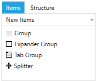
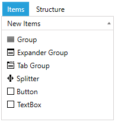

# Add Custom Element in the ToolBox

This article demonstrates how to add a custom UIElement in the NewItems section of the LayoutControlToolBoxView which is located under the Items tab. 

#### __Figure 1: The default toolbox items__


To add a new element in the toolbox you can use the __NewItems__ collection of LayoutControlToolBoxView and insert a new [LayoutControlHierarchicalNodeProxy](#layoutcontrolhierarchicalnodeproxy) object. The proxy has several properties that describe the toolbox item - header, element type and element instance - which will be used when the item is dropped in the layout control. __Example 1 and 2__ show how to set up the proxy and add it in the NewItems collection.

__Example 1: Example LayoutControlToolBoxView definition__
```XAML
	<telerik:LayoutControlToolBoxView x:Name="toolBoxView" LayoutControl="{Binding ElementName=layoutControl}">
```
	
__Example 2: Creat item proxies and add them in the NewItems collection__
```C#
	LayoutControlHierarchicalNodeProxy buttonToolBoxProxy = new LayoutControlHierarchicalNodeProxy();
	buttonToolBoxProxy.Header = "Button";
	buttonToolBoxProxy.OriginalItemType = typeof(Button);
	buttonToolBoxProxy.OriginalItem = new Button() { Content = "Button" };

	LayoutControlHierarchicalNodeProxy textBoxToolBoxProxy = new LayoutControlHierarchicalNodeProxy();
	textBoxToolBoxProxy.Header = "TextBox";
	textBoxToolBoxProxy.OriginalItemType = typeof(TextBox);
	textBoxToolBoxProxy.OriginalItem = new TextBox() { Text = "Your input.." };

	this.toolBoxView.NewItems.Add(buttonToolBoxProxy);
	this.toolBoxView.NewItems.Add(textBoxToolBoxProxy);
```
	
In __Example 2__ we add two additional proxies in the collection and they represent a TextBox and a Button which can be dragged and dropped from the toolbox to the layout control.

#### __Figure 2: The toolbox with two additional items__


>tip The custom items will be drawn using the default toolbox item icon. You can find a runnable project showing how to alter this and also the approach described in the article in our [GitHub SDK repository](https://github.com/telerik/xaml-sdk/tree/master/LayoutControl/AddCustomElementInToolBox). 

## See Also  
* [Getting Started]()
* [Visual Structure]()
* [Layout Groups Overview]()
* [Layout Panel]()
