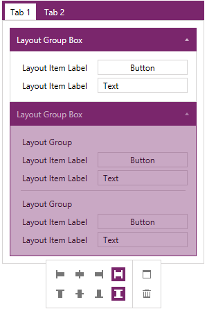

# Overview

__RadLayoutControl__ is a flexible component that allows you to arrange visual elements inside its boundaries. Thus helping you to create complex layouts that can be rearranged at runtime.

## Key Features

* __Complex layouts__: With RadLayoutControl you can create complex compositions that can be easily rearranged and resized according to the available size of the control.

* __Runtime layout customization__: You can customize the layout at any given point in time while the application is running. You can rearrange the items, delete, resize, etc. You can read more about this in the [Edit the Layout]() help article.

* __Items nesting__: You can nest layout items inside one another which gives you very flexible control over the arrangement of the layout.

* __Layout display modes__: The control allows you to define different display modes for the layout items. You can read more about this feature in the [Display Modes]() help article.

>You can find examples that demonstrate RadLayoutControl in our [demo application](http://demos.telerik.com/wpf/).

# See Also  
* [Getting Started]()
* [Display Modes]()
* [Layout Panel]()
* [Visual Structure]()