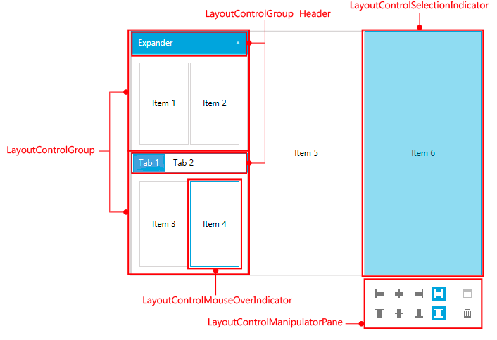

# Visual Structure

This article describes the visual elements of the __RadLayoutControl__ and defines terms and concepts that are used in the scope of the control and its documentation.

#### __Figure 1: The visual structure of RadLayoutControl__

#### __Figure 2: The visual elements involved in the drag/drop operation__

* __LayoutControlGroup__: This is an items control which is used to group UIElements or other LayoutControlGroups.

* __LayoutControlManipulationPane__: This element allows control over the properties of the selected item when the control is in edit mode.

* __LayoutControlSelectionIndicator__: This element indicates which item is selected when the control is in edit mode. Also, it allows resizing over the selected item.

* __LayoutControlMouseOverIndicator__: This element indicates the item under the mouse (the hovered item) when the control is in edit mode. 

* __LayoutControlDragVisual__: This element gives visual feedback about the dragged item. 

* __LayoutControlDropIndicator__: This element gives visual feedback about the available drop positions in the layout panels. Each available drop position is represented by a different LayoutControlDropIndicator element.

## See Also
* [Getting Started]()
* [Edit the Layout]()
* [Layout Panel]()
* [Display Modes]()

