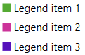

# Getting Started with {{ site.framework_name }} Legend

This tutorial will walk you through the creation of a sample application that contains __RadLegend__.

* [Adding Telerik Assemblies Using NuGet](#adding-telerik-assemblies-using-nuget)
* [Adding Assembly References Manually](#adding-assembly-references-manually)
* [Defining RadLegend and Adding Items](#defining-radlegend-and-adding-items)
* [Customizing the Legend Items](#customizing-the-legend-items)
* [Changing the Items Panel](#changing-the-items-panel)

## Adding Telerik Assemblies Using NuGet

To use __RadLegend__ when working with NuGet packages, install the `Telerik.Windows.Controls.for.Wpf.Xaml` package. The [package name may vary]() slightly based on the Telerik dlls set - [Xaml or NoXaml]()

Read more about NuGet installation in the [Installing UI for WPF from NuGet Package]() article.

>tip With the 2025 Q1 release, the Telerik UI for WPF has a new licensing mechanism. You can learn more about it [here]().

## Adding Assembly References Manually

If you are not using NuGet packages, you can add a reference to the following assemblies:

* __Telerik.Licensing.Runtime__
* __Telerik.Windows.Controls__

You can find the required assemblies for each control from the suite in the [Controls Dependencies]()[Controls Dependencies]() help article.

## Defining RadLegend and Adding Items

The RadLegend control is populated with data via its __Items__ collection. The collection is of type __LegendItemCollection__ and can be populated only with __LegendItem__ objects. By default the Items property is *null*.

#### __[XAML] Example 1: Defining RadLegend in XAML__
{{region radlegend-getting-started-0}}
	<telerik:RadLegend>
	    <telerik:RadLegend.Items>
	        <telerik:LegendItemCollection>
	            <telerik:LegendItem MarkerFill="#FF55AA33" Title="Legend item 1" />
	            <telerik:LegendItem MarkerFill="#FFCC3399" Title="Legend item 2" />
	            <telerik:LegendItem MarkerFill="#FF5511BB" Title="Legend item 3" />
	        </telerik:LegendItemCollection>
	    </telerik:RadLegend.Items>
	</telerik:RadLegend>
{{endregion}}

#### __[C#] Example 2: Defining RadLegend in code__
{{region radlegend-getting-started-1}}
	RadLegend legend = new RadLegend();
	legend.Items = new LegendItemCollection()
	{
		new LegendItem() { Title = "Legend item 1", MarkerFill = new SolidColorBrush((Color)ColorConverter.ColorFromString("#FF55AA33")) },
		new LegendItem() { Title = "Legend item 2", MarkerFill = new SolidColorBrush((Color)ColorConverter.ColorFromString("#FFCC3399")) },
		new LegendItem() { Title = "Legend item 3", MarkerFill = new SolidColorBrush((Color)ColorConverter.ColorFromString("#FF5511BB")) },
	};
{{endregion}}

#### __Figure 1: RadLegend__

## Customizing the Legend Items

The most straightforward way to customize the legend items is to set the properties of the __LegendItem__ objects added in the Items collection of the control. 

To change the fill of the item's marker set the __MarkerFill__ property of the LegendItem object. 

To change the text of the items set the __Title__ property of the LegendItem object.

To change the geometry of the marker set the __MarkerGeometry__ property. Read about this in the [Marker Geometry]() article.

The control also allows you to fully replace its items' template and define a custom visualization. To do so, set the __ItemTemplate__ property of the RadLegend control. Read more about this in the [ItemTemplate]() article.

## Changing the Items Panel

By default the RadLegend control uses a StackPanel to render its items. To change this you can replace the panel via the __ItemsPanel__ property. Read more about this in the [ItemsPanel]() article.


## Telerik UI for WPF Learning Resources

* [Getting Started with Telerik UI for WPF Components]()
* [Telerik UI for WPF Installation]()
* [Telerik UI for WPF and WinForms Integration]()
* [Telerik UI for WPF Visual Studio Templates]()
* [Setting a Theme with Telerik UI for WPF]()
* [Telerik UI for WPF Virtual Classroom (Training Courses for Registered Users)](https://learn.telerik.com/learn/course/external/view/elearning/16/telerik-ui-for-wpf) 
* [Telerik UI for WPF License Agreement](https://www.telerik.com/purchase/license-agreement/wpf-dlw-s)


## See Also
* [Scrollbar Functionality]()
* [Supported Controls]()
