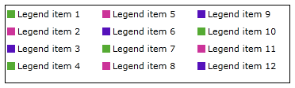
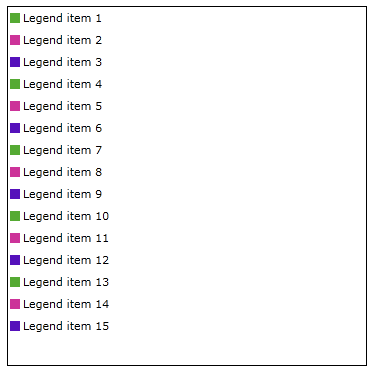

# ItemsPanel

By default the RadLegend uses a StackPanel with Vertical orientation to lay out its items. You can easily change the panel by setting the ItemsPanel property. 

The example here demonstrates the use of the ItemsPanel property and the RadWrapPanel:        

#### __XAML__
```XAML
	<Border Width="360" Height="100" BorderThickness="1" BorderBrush="Black">
	    <telerik:RadLegend>
	        <telerik:RadLegend.ItemsPanel>
	            <ItemsPanelTemplate>
	                <telerik:RadWrapPanel Orientation="Vertical" ItemWidth="120" />
	            </ItemsPanelTemplate>
	        </telerik:RadLegend.ItemsPanel>
	        <telerik:RadLegend.Items>
	            <telerik:LegendItemCollection>
	                <telerik:LegendItem MarkerFill="#FF55AA33" MarkerStroke="Black" Title="Legend item 1" />
	                <telerik:LegendItem MarkerFill="#FFCC3399" MarkerStroke="Black" Title="Legend item 2" />
	                <telerik:LegendItem MarkerFill="#FF5511BB" MarkerStroke="Black" Title="Legend item 3" />
	                <telerik:LegendItem MarkerFill="#FF55AA33" MarkerStroke="Black" Title="Legend item 4" />
	                <telerik:LegendItem MarkerFill="#FFCC3399" MarkerStroke="Black" Title="Legend item 5" />
	                <telerik:LegendItem MarkerFill="#FF5511BB" MarkerStroke="Black" Title="Legend item 6" />
	                <telerik:LegendItem MarkerFill="#FF55AA33" MarkerStroke="Black" Title="Legend item 7" />
	                <telerik:LegendItem MarkerFill="#FFCC3399" MarkerStroke="Black" Title="Legend item 8" />
	                <telerik:LegendItem MarkerFill="#FF5511BB" MarkerStroke="Black" Title="Legend item 9" />
	                <telerik:LegendItem MarkerFill="#FF55AA33" MarkerStroke="Black" Title="Legend item 10" />
	                <telerik:LegendItem MarkerFill="#FFCC3399" MarkerStroke="Black" Title="Legend item 11" />
	                <telerik:LegendItem MarkerFill="#FF5511BB" MarkerStroke="Black" Title="Legend item 12" />
	                <telerik:LegendItem MarkerFill="#FF55AA33" MarkerStroke="Black" Title="Legend item 13" />
	                <telerik:LegendItem MarkerFill="#FFCC3399" MarkerStroke="Black" Title="Legend item 14" />
	                <telerik:LegendItem MarkerFill="#FF5511BB" MarkerStroke="Black" Title="Legend item 15" />
	            </telerik:LegendItemCollection>
	        </telerik:RadLegend.Items>
	    </telerik:RadLegend>
	</Border>
```

Border height is 100  


Border height is 360  
