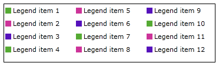
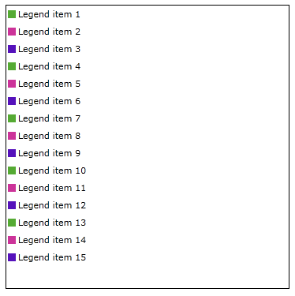

# ItemsPanel

By default the RadLegend uses a StackPanel with Vertical orientation to lay out its items. You can easily change the panel by setting the ItemsPanel property. 

The example here demonstrates the use of the ItemsPanel property and the RadWrapPanel:        

<snippet id='radlegend-itemspanel-use_of_the_itemspanel_property_and_radwrappanel-xaml' />

Border height is 100  

Border height is 360  
