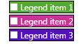

# ItemTemplate

## 

The RadLegend control exposes an ItemTemplate property which you can use to change the default ItemTemplate.
          The DataContext of the template is a LegendItem object.
        

Note that a GeometryCloneConverter is used in the Path.Data Binding.
            This is to work around a limitation in the Silverlight framework, where an exception is 
            thrown when a static resource is used to set the Data property of a Path.
          

A simple demonstration how to use the ItemTemplate property is given below:
        

#### __XAML__

{{region radlegend-overview_0_WPF}}
	<telerik:RadLegend HorizontalAlignment="Center" UseLayoutRounding="True">
	    <telerik:RadLegend.ItemTemplate>
	        <DataTemplate>
	            <Border Background="{Binding MarkerFill}" BorderThickness="1" BorderBrush="{Binding MarkerStroke}">
	                <Grid>
	                    <TextBlock Text="{Binding Title}" Foreground="White" Margin="15 0 0 0" />
	                    <Path Width="12" 
	                          Height="12" 
	                          Fill="White" 
	                          HorizontalAlignment="Left">
	                        <Path.Data>
	                            <Binding Path="ActualMarkerGeometry"
	                                 RelativeSource="{RelativeSource AncestorType=telerik:LegendItemControl}">
	                            </Binding>
	                        </Path.Data>
	                    </Path>
	                </Grid>
	            </Border>
	        </DataTemplate>
	    </telerik:RadLegend.ItemTemplate>
	    <telerik:RadLegend.Items>
	        <telerik:LegendItemCollection>
	            <telerik:LegendItem MarkerFill="#FF55AA33" MarkerStroke="Black" Title="Legend item 1" />
	            <telerik:LegendItem MarkerFill="#FFCC3399" MarkerStroke="Black" Title="Legend item 2" />
	            <telerik:LegendItem MarkerFill="#FF5511BB" MarkerStroke="Black" Title="Legend item 3" />
	        </telerik:LegendItemCollection>
	    </telerik:RadLegend.Items>
	</telerik:RadLegend>
	{{endregion}}



#### __XAML__

{{region radlegend-overview_0_SL}}
	<telerik:RadLegend HorizontalAlignment="Center" UseLayoutRounding="True">
	    <telerik:RadLegend.ItemTemplate>
	        <DataTemplate>
	            <Border Background="{Binding MarkerFill}" BorderThickness="1" BorderBrush="{Binding MarkerStroke}">
	                <Grid>
	                    <TextBlock Text="{Binding Title}" Foreground="White" Margin="15 0 0 0" />
	                    <Path Width="12" 
	                          Height="12" 
	                          Fill="White" 
	                          HorizontalAlignment="Left">
	                        <Path.Data>
	                            <Binding Path="ActualMarkerGeometry"
	                                 RelativeSource="{RelativeSource AncestorType=telerik:LegendItemControl}">
	                            	<Binding.Converter>
	                            		<telerik:GeometryCloneConverter />
	                            	</Binding.Converter>
	                            </Binding>
	                        </Path.Data>
	                    </Path>
	                </Grid>
	            </Border>
	        </DataTemplate>
	    </telerik:RadLegend.ItemTemplate>
	    <telerik:RadLegend.Items>
	        <telerik:LegendItemCollection>
	            <telerik:LegendItem MarkerFill="#FF55AA33" MarkerStroke="Black" Title="Legend item 1" />
	            <telerik:LegendItem MarkerFill="#FFCC3399" MarkerStroke="Black" Title="Legend item 2" />
	            <telerik:LegendItem MarkerFill="#FF5511BB" MarkerStroke="Black" Title="Legend item 3" />
	        </telerik:LegendItemCollection>
	    </telerik:RadLegend.Items>
	</telerik:RadLegend>
	{{endregion}}



And here is the end result:
        

# See Also
