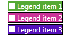

# ItemTemplate

The RadLegend control exposes an ItemTemplate property which you can use to change the default ItemTemplate. The DataContext of the template is a LegendItem object.


Note that a GeometryCloneConverter is used in the Path.Data Binding. This is to work around a limitation in the Silverlight framework, where an exception is  thrown when a static resource is used to set the Data property of a Path.


A simple demonstration how to use the ItemTemplate property is given below:



<snippet id='radlegend-itemtemplate-simple_demonstration_wpf-xaml' />




<snippet id='radlegend-itemtemplate-simple_demonstration_silverlight-xaml' />


And here is the end result:
