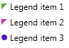

# Marker Geometry

You can change the default Geometry of the default Path in the legend item. This is easy to do by setting the DefaultMarkerGeometry property. If the LegendItem object that was given to the RadLegend has its MarkerGeometry property set (as is the third item in the example below) then this is the Geometry that is used. This happens because the MarkerGeometry has a higher priority than the DefaultMarkerGeometry. This is done in order to be possible for different legend items to be presented with different geometries.        


```XAML
	<telerik:RadLegend>
	    <telerik:RadLegend.Resources>
	        <EllipseGeometry x:Key="EllipseGeometry1" Center="6 6" RadiusX="4" RadiusY="4" />                
	    </telerik:RadLegend.Resources>
	    <telerik:RadLegend.DefaultMarkerGeometry>
	        <PathGeometry>
	            <PathFigure StartPoint="2 2">
	                <PathFigure.Segments>
	                    <LineSegment Point="10 2"/>
	                    <LineSegment Point="2 10"/>
	                    <LineSegment Point="2 2"/>
	                </PathFigure.Segments>
	            </PathFigure>
	        </PathGeometry>
	    </telerik:RadLegend.DefaultMarkerGeometry>
	    <telerik:RadLegend.Items>
	        <telerik:LegendItemCollection>
	            <telerik:LegendItem MarkerFill="#FF55AA33" MarkerStroke="Black" Title="Legend item 1" />
	            <telerik:LegendItem MarkerFill="#FFCC3399" MarkerStroke="Black" Title="Legend item 2" />
	            <telerik:LegendItem MarkerFill="#FF5511BB" MarkerStroke="Black" Title="Legend item 3" MarkerGeometry="{StaticResource EllipseGeometry1}" />
	        </telerik:LegendItemCollection>
	    </telerik:RadLegend.Items>
	</telerik:RadLegend>
```

This is the final result:  
