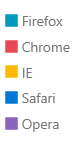

# Overview




The RadLegend is a standalone control which visualizes a list of items. The items with which the control works are of type __Telerik.Windows.Controls.Legend.LegendItem__. In order for items to be visualized, the LegendItem objects must be passed to the RadLegend in a LegendItemCollection.        

>In order to use the RadLegend in your project you have to add references to the following assembly:
>	- __Telerik.Windows.Controls.dll__  
> After adding references to Controls dll you can access the RadLegend element in XAML through the following namespace declaration:
> `xmlns:telerik="http://schemas.telerik.com/2008/xaml/presentation"`

Below is given a simple way to use the RadLegend control:       

#### __XAML__
{{region radlegend-overview_1}}
	<telerik:RadLegend>
	    <telerik:RadLegend.Items>
	        <telerik:LegendItemCollection>
	            <telerik:LegendItem MarkerFill="#FF55AA33" Title="Legend item 1" />
	            <telerik:LegendItem MarkerFill="#FFCC3399" Title="Legend item 2" />
	            <telerik:LegendItem MarkerFill="#FF5511BB" Title="Legend item 3" />
	        </telerik:LegendItemCollection>
	    </telerik:RadLegend.Items>
	</telerik:RadLegend>
{{endregion}}

The RadLegend is easily customized through the DefaultMarkerGeometry, ItemTemplate and ItemsPanel properties.