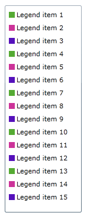
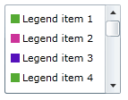

# ScrollBar Functionality

In this article you can find how to add scroll bar functionality to the control.

By default the RadLegend uses a StackPanel with Vertical orientation to lay out the legend items. Sometimes it is necessary to show many items in the legend and when there is not enough space some items will not be visible. One option to avoid this is to use a ScrollViewer to wrap the RadLegend in:        

<snippet id='radlegend-scrollbar-functionality-use_scrollviewer_to_wrap_radlegend-xaml' />

Here is the end result:        

ScrollViewer height is 350  

ScrollViewer height is 100  
