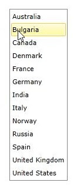
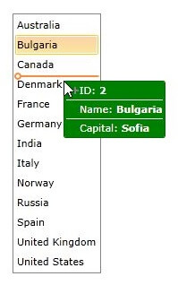

# How to customize the DragVisualProvider

In __RadListBox__ it is possible to enrich the drag-drop functionality of the control by creating a custom __DragVisualProvider__ or using one of the built-in DragVisualProviders. More information about the built-in DragVisualProviders could be found [here]().     

## Custom DragVisualProvider

The next example will demonstrate the how to create a custom DragVisualProvider in order to change its __Foreground__, __Background__, __BorderBrush__ and __Template__.

>Before proceeding with this example you should get familiar with [Drag and Drop: Overview](), [Implicit Styles]() and [Binding To Object]().          

1. First you will need to create a __Country__ class with the necessary properties:            

	__Country class creation__

	<snippet id='radlistbox-drag-and-drop-customize-the-dragvisualprovider-block_1-cs' />

2. Next you should create a __Countries__ collection in your ViewModel and populate it with some sample data:            

	__ViewModel declaration___

	<snippet id='radlistbox-drag-and-drop-customize-the-dragvisualprovider-block_2-cs' />

3. In the App.xaml file merge the necessary __ResourceDictionary__ for the RadListBox control based on the theme you are using. This example uses the Office_Black theme:            

	__Merging the necessary ResourceDictionary__

	<snippet id='radlistbox-drag-and-drop-customize-the-dragvisualprovider-block_3-xaml' />

4. Next you will need to create a Style in the same file that targets __ListBoxDragVisual__ and set its Foreground, Background, BorderBrush and Template properties:           

	__Style targeting ListBoxDragVisual__

	<snippet id='radlistbox-drag-and-drop-customize-the-dragvisualprovider-block_4-xaml' />

	You can find the entire ListBoxDragVisual Template code in each specific theme for the RadListBox control.            

	>The custom __DragVisualStyle__ must be created in the App.xaml file as the __DragVisualProvider__ is placed inside of another visual tree and cannot be targeted from the Page/Window where RadListBox is placed.              

5. Finally you will need to declare the __RadListBox__ control. The xaml of the control should look like this:            

	__RadListBox declaration__

	<snippet id='radlistbox-drag-and-drop-customize-the-dragvisualprovider-block_5-xaml' />

	>tip Find a runnable project of the previous example in the [WPF Samples GitHub repository](https://github.com/telerik/xaml-sdk/tree/master/ListBox/CustomDragVisualStyle).

	The next screenshots show the final result:

	

	

## See Also

 * [Overview]()

 * [Drag-Drop between RadListBox and RadScheduleView]()