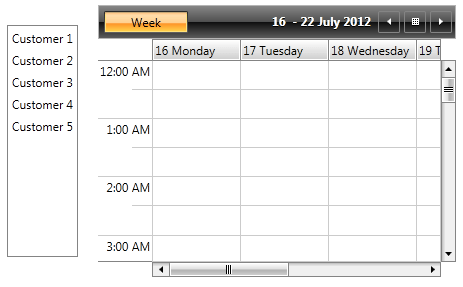
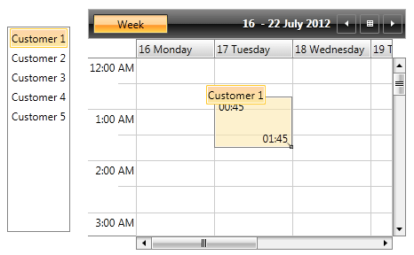
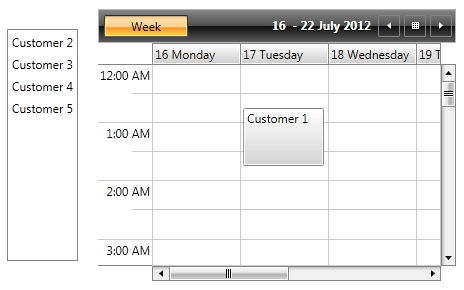

# Drag-Drop between RadListBox and RadScheduleView

This help topic will explain in details the drag-drop functionality between RadListBox and RadScheduleView controls.

## Drag-Drop between RadListBox and RadScheduleView

To enable drag and drop between RadListBox and RadScheduleView, we should convert the data used in both controls to the corresponding type. RadListBox should have a ListBoxDragDropBehavior and a DataConverter set. The DataConverter is used to convert the dragged appointments from the ScheduleView to the ListBox. Also note that you should customize the ScheduleView DragDropBehavior in order to convert the ListBox items to ScheduleView Appointments:

We will go through a simple example to illustrate the approach. RadListBox is bound to a collection of Customer objects which will be converted to Appointments and vice versa.

* Create a Customer class:

__Business object creation__

```C#
	public class Customer
	{
	    public string Name { get; set; }
	    public int ID { get; set; }
	}
```

* Create a ViewModel that initializes the ListBox ItemsSource and the ScheduleView AppointmentsSource and populate them with simple data:

__ViewModel creation__

```C#
	public ObservableCollection<Customer> CustomersSource { get; private set; }
	public ObservableCollection<Appointment> AppointmentsSource { get; private set; }
	public ViewModel()
	{
	    var monday = new DateTime(DateTime.Today.Year, DateTime.Today.Month, CalendarHelper.GetFirstDayOfWeek(DateTime.Today, DayOfWeek.Sunday).Day);
	    this.CustomersSource = new ObservableCollection<Customer> 
	 {
	  new Customer { ID = 1, Name = "Customer 1" },
	  new Customer { ID = 2, Name = "Customer 2" },
	  new Customer { ID = 3, Name = "Customer 3" },
	  new Customer { ID = 4, Name = "Customer 4" },
	  new Customer { ID = 5, Name = "Customer 5" } 
	 };
	    this.AppointmentsSource = new ObservableCollection<Appointment> 
	 { 
	  new Appointment { Start = monday, End = monday.AddHours(1), Subject = "Appointment 1" },
	  new Appointment { Start = monday, End = monday.AddHours(1), Subject = "Appointment 2" },
	  new Appointment { Start = monday, End = monday.AddHours(1), Subject = "Appointment 3" },
	  new Appointment { Start = monday, End = monday.AddHours(1), Subject = "Appointment 4" },
	  new Appointment { Start = monday, End = monday.AddHours(1), Subject = "Appointment 5" } 
	 };
	}
```

* Create AppointmentToCustomerConverter class that inherits DataConverter:

__AppointmentToCustomerConverter class creation__

```C#
	public class AppointmentToCustomerConverter : DataConverter
	{
	    public override string[] GetConvertToFormats()
	    {
	        return new string[] { typeof(ScheduleViewDragDropPayload).FullName, typeof(Customer).FullName };
	    }
	    public override object ConvertTo(object data, string format)
	    {
	        var payload = DataObjectHelper.GetData(data, typeof(ScheduleViewDragDropPayload), false) as ScheduleViewDragDropPayload;
	        if (payload != null)
	        {
	            var customers = payload.DraggedAppointments;
	            return customers.OfType<Appointment>().Select(a => new Customer { Name = a.Subject });
	        }
	        return null;
	    }
	}
```

* Create custom ScheduleViewDragDropBehavior that inherits ScheduleViewDragDropBehavior:

__ScheduleViewDragDropBehavior__

```C#
	public class ScheduleViewDragDropBehavior : Telerik.Windows.Controls.ScheduleViewDragDropBehavior
	{
	    public object customers { get; set; }
	    public override IEnumerable<IOccurrence> ConvertDraggedData(object data)
	    {
	        if (DataObjectHelper.GetDataPresent(data, typeof(Customer), false))
	        {
	            var customers = DataObjectHelper.GetData(data, typeof(Customer), true) as IEnumerable;
	            if (customers != null)
	            {
	                var newApp = customers.OfType<Customer>().Select(c => new Appointment { Subject = c.Name });
	                return newApp;
	            }
	        }
	        return base.ConvertDraggedData(data);
	    }
	}
```

* Create a RadListBoxItem Style that will enable the drag of the RadListBoxItem controls:

__RadListBoxItem Style__

```XAML
	<Style x:Key="DraggableListBoxItem" TargetType="telerik:RadListBoxItem">
	    <Setter Property="telerik:DragDropManager.AllowCapturedDrag" Value="True" />
	</Style>
```

* The final configuration of the two controls in XAML should look like:

__Configuration of RadListBox and RadScheduleView__

```XAML
	<telerik:RadListBox x:Name="ListBox"
						ItemsSource="{Binding CustomersSource}" 
						DisplayMemberPath="Name" 
						ItemContainerStyle="{StaticResource DraggableListBoxItem}">
		<telerik:RadListBox.DragVisualProvider>
			<telerik:ScreenshotDragVisualProvider />
		</telerik:RadListBox.DragVisualProvider>
		<telerik:RadListBox.DataConverter>
			<local:AppointmentToCustomerConverter />
		</telerik:RadListBox.DataConverter>
		<telerik:RadListBox.DragDropBehavior>
			<telerik:ListBoxDragDropBehavior />
		</telerik:RadListBox.DragDropBehavior>
	</telerik:RadListBox>
	<telerik:RadScheduleView x:Name="scheduleView" 
								AppointmentsSource="{Binding AppointmentsSource}">
		<telerik:RadScheduleView.ViewDefinitions>
			<telerik:DayViewDefinition />
		</telerik:RadScheduleView.ViewDefinitions>
		<telerik:RadScheduleView.DragDropBehavior>
			<local:ScheduleViewDragDropBehavior />
		</telerik:RadScheduleView.DragDropBehavior>
	</telerik:RadScheduleView>
```

Here is the end result:







## See Also

 * [Overview]()
