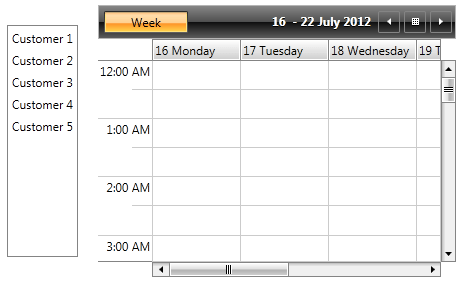
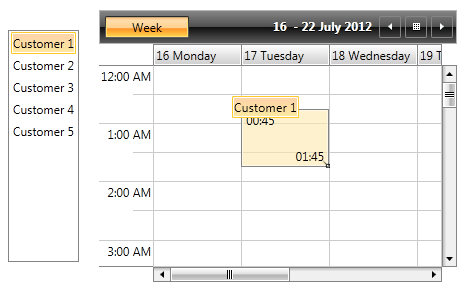
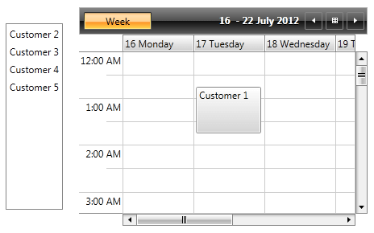

# Drag-Drop between RadListBox and RadScheduleView

This help topic will explain in details the drag-drop functionality between RadListBox and RadScheduleView controls.

## Drag-Drop between RadListBox and RadScheduleView

To enable drag and drop between RadListBox and RadScheduleView, we should convert the data used in both controls to the corresponding type. RadListBox should have a ListBoxDragDropBehavior and a DataConverter set. The DataConverter is used to convert the dragged appointments from the ScheduleView to the ListBox. Also note that you should customize the ScheduleView DragDropBehavior in order to convert the ListBox items to ScheduleView Appointments:

We will go through a simple example to illustrate the approach. RadListBox is bound to a collection of Customer objects which will be converted to Appointments and vice versa.

* Create a Customer class:

__Business object creation__

<snippet id='radlistbox-drag-and-drop-features-dragdrop-scheduleview-block_1-cs' />

* Create a ViewModel that initializes the ListBox ItemsSource and the ScheduleView AppointmentsSource and populate them with simple data:

__ViewModel creation__

<snippet id='radlistbox-drag-and-drop-features-dragdrop-scheduleview-block_2-cs' />

* Create AppointmentToCustomerConverter class that inherits DataConverter:

__AppointmentToCustomerConverter class creation__

<snippet id='radlistbox-drag-and-drop-features-dragdrop-scheduleview-block_3-cs' />

* Create custom ScheduleViewDragDropBehavior that inherits ScheduleViewDragDropBehavior:

__ScheduleViewDragDropBehavior__

<snippet id='radlistbox-drag-and-drop-features-dragdrop-scheduleview-block_4-cs' />

* Create a RadListBoxItem Style that will enable the drag of the RadListBoxItem controls:

__RadListBoxItem Style__

<snippet id='radlistbox-drag-and-drop-features-dragdrop-scheduleview-block_5-xaml' />

* The final configuration of the two controls in XAML should look like:

__Configuration of RadListBox and RadScheduleView__

<snippet id='radlistbox-drag-and-drop-features-dragdrop-scheduleview-block_6-xaml' />

Here is the end result:

## See Also

 * [Overview]()