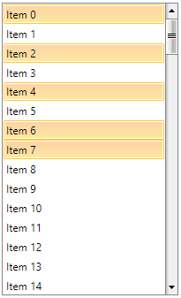

# SelectedItemsSource

With the Q1 2015 release version of UI for WPFSilverlight, the ability to manipulate the __SelectedItems__ collection of __RadListBox__ through the ViewModel is now available. This is now possible with the brand new __ListBoxSelectedItemsBehavior__ behavior and its __SelectedItemsSource__ attached property. The __SelectedItemsSource__ is a collection that synchronizes itself with the __SelectedItems__ collection of __RadListBox__ – thus if an item is added, removed or the collection is replaced/cleared those actions will be executed on the __SelectedItems__ collection as well.

## Using the SelectedItemsSource

The following example will demonstrate how to bind the __SelectedItemsSource__ property of the __ListBoxSelectedItemsBehavior__ to a collection of custom objects. In order the synchronization between the __SelectedItemSource__ and the __SelectedItems__ of __RadListBox__ control to be possible the bound collection should implement both the __IEnumerable__ and the __INotifyCollectionChanged__ interfaces.

>important Synchronization won’t be possible if __SelectedItemsSource__ is bound to a collection that does not implement __INotifyCollectionChanged__.

First, you need to create a new business object named for example Item. Its structure is shown in the code-snippet below:

__Business object Item__

<snippet id='radlistbox-features-selecteditemssource-block_1-cs' />
<snippet id='radlistbox-features-selecteditemssource-block_2-vb' />

Next thing you have to do is to create a new class named ViewModel that inherits the Telerik __ViewModelBase__ abstract class – inside it initialize two collections with sample data. The first one will be for the __ItemsSource__ of __RadListBox__ while the second one will be the data source for the __SelectedItemsSource__ property:

__Creating the ViewModel__

<snippet id='radlistbox-features-selecteditemssource-block_3-cs' />
<snippet id='radlistbox-features-selecteditemssource-block_4-vb' />

>important The __SelectedItemsSource__ and the __ItemsSource__ should be bound to collections of the same type of items.

Next you should declare the ViewModel as DataContext in your XAML:

__Set the ViewModel as DataContext__

<snippet id='radlistbox-features-selecteditemssource-block_5-xaml' />

Finally, all you need to do is to set both created collection of items to the __ItemsSource__ and __ListBoxSelectedItemsBehavior. SelectedItemsSource__:

__Set the ItemsSource and SelectedItemsSource__

<snippet id='radlistbox-features-selecteditemssource-block_6-xaml' />

The final result is shown on the snapshot below:

>tip Find a runnable project of the previous example in the [WPF Samples GitHub repository](https://github.com/telerik/xaml-sdk/tree/master/ListBox/SelectedItemsSource).

## See Also

* [Selection]()

* [Binding to Object] ()