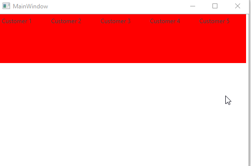

# VirtualizingWrapPanel

This article will describe the [VirtualizingWrapPanel](https://docs.telerik.com/devtools/wpf/api/telerik.windows.controls.virtualizingwrappanel) and how it can be used as an ItemsPanel for a RadListBox.

## Key Properties

* __ItemHeight__: Gets or sets a value that specifies the Height of all items that are contained within a VirtualizingWrapPanel.
* __ItemWidth__: Gets or sets a value that specifies the Width of all items that are contained within a VirtualizingWrapPanel.
* __ScrollStep__: Gets or sets a value for the amount that will be scrolled when using the mouse wheel or the scrollbar buttons (Not supported when grouping is enabled).

	> Scrolling with the __Page up__ and __Page down__ keys and navigating with the __Left__ and __Right__ arrow keys is not supported when grouping is enabled. 

* __VirtualizingPanel.ScrollUnit__ : The possible values are __Pixel__ (the scrolling is pixel based) and __Item__ (the scrolling is item based). (When grouping is enabled, only __Pixel__ is supported). The default value is __Item__.
* __VirtualizingPanel.IsVirtualizingWhenGrouping__ : Set this property to __True__ to enable virtualizing when grouping. 
* __VirtualizingPanel.VirtualizationMode__: Specifies the method the panel will use to manage virtualizing its child items. The possible values are __Standard__ (create and discard the item containers) and __Recycling__ (reuse the item containers).

	The ScrollUnit, IsVirtualizingWhenGroupinga and VirtualizationMode properties are available in .NET 4.6.2 and later.

## VirtualizingWrapPanel

In order to demonstrate how the VirtualizingWrapPanel can be used, we will setup some sample data as demonstrated in __Example 1__.

__Example 1: Setting up the model and viewmodel__

```C#
	public class ViewModel : ViewModelBase
    {
        private ObservableCollection<Customer> customers;
        private CollectionViewSource collectionViewSource = new CollectionViewSource();
        private ICollectionView customersView;

        public ViewModel()
        {
            this.Customers = new ObservableCollection<Customer>()
			{
				new Customer { Id = 1, Name = "Customer 1" },
				new Customer { Id = 2, Name = "Customer 2" },
				new Customer { Id = 3, Name = "Customer 3" },
				new Customer { Id = 4, Name = "Customer 4" },
				new Customer { Id = 5, Name = "Customer 5" } 
			};
            
            this.collectionViewSource.Source = this.Customers;
            
            this.collectionViewSource.View.GroupDescriptions.Add(new PropertyGroupDescription("Name"));
            this.CustomersView = this.collectionViewSource.View;
        }

        public ObservableCollection<Customer> Customers
        {
            get { return this.customers; }
            set
            {
                if (this.customers != value)
                {
                    this.customers = value;
                    this.OnPropertyChanged(() => this.Customers);
                }
            }
        }

        public ICollectionView CustomersView
        {
            get
            {
                return this.customersView;
            }
            set
            {
                if(this.customersView != value)
                {
                    this.customersView = value;
                    this.OnPropertyChanged(() => this.CustomersView);
                }
            }
        }
    }
```
```VB.NET
	Public Class Customer
		Public Property Name() As String
		Public Property Id() As Integer
    End Class

    Public Class ViewModel
	Inherits ViewModelBase
		Private _customers As ObservableCollection(Of Customer)
		Private collectionViewSource As New CollectionViewSource()
		Private _customersView As ICollectionView

		Public Sub New()
			Me.Customers = New ObservableCollection(Of Customer)() From {
				New Customer With {
					.Id = 1,
					.Name = "Customer 1"
				},
				New Customer With {
					.Id = 2,
					.Name = "Customer 2"
				},
				New Customer With {
					.Id = 3,
					.Name = "Customer 3"
				},
				New Customer With {
					.Id = 4,
					.Name = "Customer 4"
				},
				New Customer With {
					.Id = 5,
					.Name = "Customer 5"
				}
			}
            
            'This will be needed in order to group the data
			Me.collectionViewSource.Source = Me.Customers

			Me.collectionViewSource.View.GroupDescriptions.Add(New PropertyGroupDescription("Name"))
			Me.CustomersView = Me.collectionViewSource.View
		End Sub

		Public Property Customers() As ObservableCollection(Of Customer)
			Get
				Return Me._customers
			End Get
			Set(ByVal value As ObservableCollection(Of Customer))
				If Me._customers IsNot value Then
					Me._customers = value
					Me.OnPropertyChanged(Function() Me.Customers)
				End If
			End Set
		End Property

		Public Property CustomersView() As ICollectionView
			Get
				Return Me._customersView
			End Get
			Set(ByVal value As ICollectionView)
				If Me._customersView IsNot value Then
					Me._customersView = value
					Me.OnPropertyChanged(Function() Me.CustomersView)
				End If
			End Set
		End Property
    End Class
```

## Setting up the RadListBox

__Example 2__ demonstrates how the VirtualizingWrapPanel can be used as an ItemsPanel for a __RadListBox__. You can read some more about the benefits of UI Virtualization in the following [article](https://docs.microsoft.com/en-us/dotnet/framework/wpf/advanced/optimizing-performance-controls#displaying-large-data-sets).

__Example 2: RadListBox with VirtualizingWrapPanel as ItemsPanel__
```XAML
	<UserControl>
		<UserControl.Resources>
			<local:ViewModel x:Key="ViewModel" />
		</UserControl.Resources>
		<Grid DataContext="{StaticResource ViewModel}">
			<telerik:RadListBox ItemsSource="{Binding CustomersView}" 
								DisplayMemberPath="Name">
				<telerik:RadListBox.ItemContainerStyle>
					<!-- If you are using the NoXaml binaries, you will have to base the style on the default one for the theme like so: 
					<Style TargetType="telerik:RadListBoxItem" BasedOn="{StaticResource RadListBoxItemStyle}">-->

					<Style TargetType="telerik:RadListBoxItem">
						<Setter Property="Background" Value="Red" />
					</Style>
				</telerik:RadListBox.ItemContainerStyle>
				<telerik:RadListBox.ItemsPanel>
					<ItemsPanelTemplate>
						<telerik:VirtualizingWrapPanel  />
					</ItemsPanelTemplate>
				</telerik:RadListBox.ItemsPanel>
			</telerik:RadListBox>
		</Grid>
	</UserControl>	
```

#### __Figure 1: Result from Example 2 in the Office2016 theme__


## Grouping

__Example 3__ demonstrates how you can apply grouping to the data by setting the __GroupStyle__ property. Otherwise, the example uses the same setup as __Example 2__.

__Example 3: Grouped RadListBox with VirtualizingWrapPanel as ItemsPanel__
```XAML
	<telerik:RadListBox.GroupStyle>
		<GroupStyle>
			<GroupStyle.HeaderTemplate>
				<DataTemplate>
					<TextBlock Text="{Binding Name}" Background="Green" />
				</DataTemplate>
			</GroupStyle.HeaderTemplate>
		</GroupStyle>
	</telerik:RadListBox.GroupStyle>
```

## Grouping and Virtualization

The VirtualizingWrapPanel supports virtualization when the data is grouped. This feature is only available for __.NET 4.6.2__ and above.

In order to turn on this feature, you have to set the __VirtualizingPanel.IsVirtualizingWhenGrouping__ attached property to __True__.

Additionally, you have to set the __VirtualizingPanel.ScrollUnit__ to __Pixel__, since __VirtualizingPanel.ScrollUnit="Item"__ is not supported while grouping. Optionally, you can also set the __VirtualizingPanel.VirtualizationMode__ property to __Recycling__ in order for the item containers to be recycled during scrolling.

__Example 4: Turning on virtualization while grouping__
```XAML
	<telerik:RadListBox VirtualizingPanel.ScrollUnit="Pixel"
						VirtualizingPanel.IsVirtualizingWhenGrouping="True"
						VirtualizingPanel.VirtualizationMode="Recycling">
		<telerik:RadListBox.GroupStyle>
			<GroupStyle>
				<GroupStyle.HeaderTemplate> 
					<DataTemplate> 
						<TextBlock Text="{Binding Name}" Background="Green" /> 
					</DataTemplate> 
				</GroupStyle.HeaderTemplate> 
				<GroupStyle.Panel>
					<ItemsPanelTemplate>
						<VirtualizingWrapPanel
							VirtualizingPanel.IsVirtualizing="True"
							VirtualizingPanel.IsVirtualizingWhenGrouping="True"
							VirtualizingPanel.ScrollUnit="Pixel"
							VirtualizingPanel.VirtualizationMode="Recycling"/>
					</ItemsPanelTemplate>
				</GroupStyle.Panel>
			</GroupStyle>
		</telerik:RadListBox.GroupStyle>
	</telerik:RadListBox>
```

>Note that you also need to set the attached properties on the panel in the **GroupStyle** as they will not be transferred automatically.

>important When the __VirtualizingPanel.IsVirtualizingWhenGrouping__ property is set to __True__, the __VirtualizingPanel.ScrollUnit__ needs to be __Pixel__, since __VirtualizingPanel.ScrollUnit="Item"__ is not supported.

## See Also

* [Binding To Object]()
