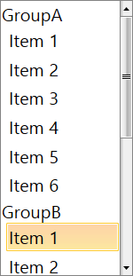

# Grouping

The __ListBox__ component allows you to easily group the items with the help of a `CollectionViewSource` object and the `GroupStyle` property of the control. The grouping feature not only provides a nice visualization of the items, but using the group style, you can easily customize the groups.

In order for the scrolling of the grouped items to be possible, you must set the `IsScrollIntoViewEnabled` property to `false`. The property was introduced with __SP1 Q3 2015__ and determines whether the selected item will automatically be scrolled into the view. When it is set to *true* (the default value) and an item gets selected, the item is brought into view by scrolling to it. Because that behavior is not expected when grouping is used, the property needs to be set to *false*.

The following example demonstrates how to bind the `ItemsSource` property of `RadListBox` to a `CollectionViewSource` with custom objects grouped by one of their properties.

1. Create a model for the items.

	__Business object Item__  
	<snippet id='radlistbox-group-items-block_1-cs' />
	<snippet id='radlistbox-group-items-block_1-vb' />

2. Create a view model class holding the data and setup the `CollectionViewSource`. 

	__ViewModel creation__  
	<snippet id='radlistbox-group-items-block_2-cs' />
	<snippet id='radlistbox-group-items-block_2-vb' />

3. Create a new instance of the view model and assign it to the DataContext of the view.

	__Set the ViewModel as DataContext__  
	<snippet id='radlistbox-group-items-block_3-xaml' />

4. Assign the `ItemsSource` and `GroupStyle` properties.

	__Set the ItemsSource and GroupStyle__  
	<snippet id='radlistbox-group-items-block_4-xaml' />

__RadListBox with grouping enabled__

	
## See Also  

* [Get Started with UI for WPF]()