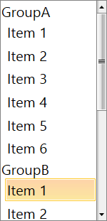

# How to group items

In __RadListBox__ you can easily group the items based on their properties with the help of __CollectionViewSource__ and __GroupStyle__. This grouping feature not only provides a nice visualization of the items, but using the __GroupStyle__, you can easily customize the groups.

The following example will demonstrate how to bind the __ItemsSource__ property of __RadListBox__ to a __CollectionViewSource__ of custom objects grouped by one of their properties. In order for the scrolling of the grouped items to be possible, you must set the __IsScrollIntoViewEnabled__ property to "False".

>important The __IsScrollIntoViewEnabled__ was introduced with SP1 Q3 2015 and determines whether the selected item will automatically be scrolled into the view. When it is set to True (this is the default value) and an item gets selected, the item is brought into view by scrolling to it. Because that behavior is not expected when grouping is used, the property needs to be set to False – thus it will be allowed the selection of an item in a group without the need of scrolling to that group.<<COMMENT: This last phrase does not make sense. I think you can fix it if you say what selects the group.>>

In the example below, you create a new business object named Item. The implementation of the class is presented below:

#### __[C#]  Business object Item__

{{region radlistbox-how-to-group-items-0}}
	public class Item
	{
		public string Group { get; set; }
		public string Name { get; set; }
	}
{{endregion}}

#### __[VB]  Business object Item__

{{region radlistbox-how-to-group-items-0}}
	Public Class Item
		Public Property Group() As String
		Public Property Name() As String
	End Class
{{endregion}}

Next, you create a new class named ViewModel – inside it you need to initialize two collections. The first collection will be used as a source for the __CollectionViewSource__ while the second one will be the __CollectionViewSource__ itself:

#### __[C#]  ViewModel creation__

{{region radlistbox-how-to-group-items-1}}
	public ObservableCollection<Item> Collection { get; set; }

	public CollectionViewSource CollectionView { get; set; }

	public ViewModel()
	{
		this.Collection = new ObservableCollection<Item>
		{
			new Item { Group = "GroupA", Name = "Item 1" },
			new Item { Group = "GroupA", Name = "Item 2" },
			new Item { Group = "GroupA", Name = "Item 3" },
			new Item { Group = "GroupA", Name = "Item 4" },
			new Item { Group = "GroupA", Name = "Item 5" },
			new Item { Group = "GroupA", Name = "Item 6" },
			new Item { Group = "GroupB", Name = "Item 1" },
			new Item { Group = "GroupB", Name = "Item 2" },
			new Item { Group = "GroupB", Name = "Item 3" }
		};

		var view = new CollectionViewSource();
		view.GroupDescriptions.Add(new PropertyGroupDescription("Group"));
		view.Source = Collection;

		CollectionView = view;
	}
{{endregion}}

#### __[VB]  ViewModel creation__

{{region radlistbox-how-to-group-items-1}}
	Public Property Collection() As ObservableCollection(Of Item)

	Public Property CollectionView() As CollectionViewSource

	Public Sub New()
		Me.Collection = New ObservableCollection(Of ItemVM) From {
			New Item With {.Group = "GroupA", .Name = "Item 1"},
			New Item With {.Group = "GroupA", .Name = "Item 2"},
			New Item With {.Group = "GroupA", .Name = "Item 3"},
			New Item With {.Group = "GroupA", .Name = "Item 4"},
			New Item With {.Group = "GroupA", .Name = "Item 5"},
			New Item With {.Group = "GroupA", .Name = "Item 6"},
			New Item With {.Group = "GroupB", .Name = "Item 1"},
			New Item With {.Group = "GroupB", .Name = "Item 2"},
			New Item With {.Group = "GroupB", .Name = "Item 3"}
		}

		Dim view = New CollectionViewSource()
		view.GroupDescriptions.Add(New PropertyGroupDescription("Group"))
		view.Source = Collection
		CollectionView = view
	End Sub
{{endregion}}

Next, you should declare the ViewModel as DataContext in your XAML:

#### __[XAML]  Set the ViewModel as DataContext__

{{region radlistbox-how-to-group-items-0}}
	<UserControl.DataContext>
        <local:ViewModel/>
	</UserControl.DataContext>
{{endregion}}

Finally, all you need to do is to set the __ItemsSource__ and __GroupStyle__ properties:

#### __[XAML]  Set the ItemsSource and GroupStyle__

{{region radlistbox-how-to-group-items-1}}
	 <telerik:RadListBox x:Name="radlistbox" IsScrollIntoViewEnabled="False"
                                ItemsSource="{Binding CollectionView.View}"  
                                DisplayMemberPath="Name">
        <telerik:RadListBox.GroupStyle>
            <GroupStyle/>
        </telerik:RadListBox.GroupStyle>
	</telerik:RadListBox>
{{endregion}}

The final result is shown on the snapshot below:

