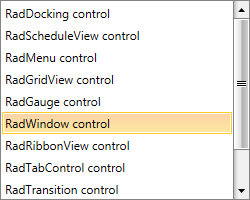

# Overview



Thank you for choosing Telerik __RadListBox__!

__RadListBox__ is a {{ site.framework_name }} control used to display a list of items from which the user can choose. The control has a number of advanced features like multiple selection, autocomplete, keyboard support, drag and drop, as well as rich customization capabilities.

## Key Features:

* __Selection__: RadListBox provides three selection modes - Single, Multiple and Extended. Read more about this in the [Selection]() article.

* __AutoComplete__: When the control is focused, the first matching item is selected while the user is typing. Read more about this in the [Autocomplete]() article.

* __Drag and Drop__: Take advantage of the built-in drag and drop support to reorder items or move them from one RadListBox to another. Read more about this in the [Drag and Drop]() section.

* __Keyboard Support__: RadListBox supports several keyboard shortcuts for performing the most common task. Read more about this in the [Keyboard Support]() article.

* __Theming__: As any other control from the UI for {{ site.framework_name }} suite, RadListBox comes with different themes. Read more about this in the [Styling and Appearance]() section of the documentation. 

>caution  If you are using [NoXaml binaries](), and you have custom Style targeting RadListBoxItem, you have to base the style on the default one of the control. Example 1 demonstrates this approach. __Example 1__ demonstrate this approach.

#### __[C#] Example 1: Implicit Style with BasedOn property set__
	{{region cs-radlistbox-overview_1}}
	 <Style TargetType="telerik:RadListBoxItem" BasedOn="{StaticResource RadListBoxItemStyle}"/>
{{endregion}}

         
>tip Get started with the control with its [Getting Started]() help article that shows how to use it in a basic scenario.

> Check out the control demos at [demos.telerik.com](https://demos.telerik.com/silverlight/#ListBox)[demos.telerik.com](https://demos.telerik.com/wpf/)

## See Also
 * [Getting Started]()
 * [Events]()