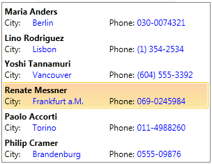
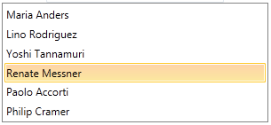

# Binding To Object

To bind the __RadListBox__ to a collection of business objects, you should use its __ItemsSource__ property and define the __DataTemplate__ that is needed to display the data from the collection. If you want the changes to the collection to be automatically reflected to the __RadListBoxItems__, the collection should implement the __INotifyCollectionChanged__ interface, as well as your business object to implement the __INotifyPropertyChanged__ interface.		

The following tutorial will guide you how to bind a __RadListBox__ to a collection of business objects. Two cases will be shown:

* [Using custom ItemTemplate](#using-custom-itemtemplate)

* [Using DisplayMemberPath property](#using-displaymemberpath)

>tipBefore reading this tutorial you should get familiar with the [Data Binding]() support of the RadListBox control.

In order to bind a __RadListBox__ to a collection of business objects, you should perform the following instructions:

* Add a new __RadListBox__ declaration in your XAML:    	

__Declaring RadListBox__

```XAML
	<telerik:RadListBox x:Name="radListBox" Width="300" />
```

* Create a new business object named Customer. Its structure is shown on the next code-snippet:

__Business object implementation__

```C#
	public class Customer
	{
		public string Name { get; set; }
		public string City { get; set; }		
		public string Phone { get; set; }
		public Customer(string name, string city, string phone)
		{
			this.Name = name;
			this.City = city;
			this.Phone = phone;
		}
	}
```

The __RadListBox__ control will be bound to an ObservableCollection of Customer objects.

* Create a new class named __CustomerViewModel__. In fact, this will be the data source for the listbox. This class has only one purpose - to initialize a collection with sample data.    	

__ViewModel__

```C#
	public class CustomerViewModel
	{
		public ObservableCollection<Customer> Customers { get; set; }
		public CustomerViewModel()
		{
			this.Customers = new ObservableCollection<Customer>()
			{
				new Customer("Maria Anders", "Berlin", "030-0074321"),
				new Customer("Lino Rodriguez", "Lisbon", "(1) 354-2534"),
				new Customer("Yoshi Tannamuri", "Vancouver","(604) 555-3392"),
				new Customer("Renate Messner","Frankfurt a.M.","069-0245984"),
				new Customer("Paolo Accorti","Torino","011-4988260"),
				new Customer("Philip Cramer","Brandenburg","0555-09876")
			};
		}
	}
```

* Declare the __CustomerViewModel__ as a resource in your XAML:    		

__Declaring the ViewModel as resource__

```XAML
	  <UserControl.Resources>
	    <example:CustomerViewModel x:Key="CustomerViewModel" />
	  </UserControl.Resources>
```

* Update your __RadListBox__ declaration and its __ItemsSource__ property:    		

__Setting the ItemsSource__

```XAML
	<telerik:RadListBox x:Name="radListBox1" Width="300" 
			ItemsSource="{Binding Customers, Source={StaticResource CustomerViewModel}}" />
```

## Using Custom ItemTemplate

* The final step is to create a custom __DataTemplate__ and set it to the __RadListBox__'s __ItemTemplate__ property.

__Declaring the ItemTemplate__

```XAML
	<DataTemplate x:Key="ListBoxCustomTemplate">
	  <Grid Margin="0" Width="300">
	    <Grid.ColumnDefinitions>
	      <ColumnDefinition />
	      <ColumnDefinition />
	    </Grid.ColumnDefinitions>
	    <Grid.RowDefinitions>
	      <RowDefinition />
	      <RowDefinition />
	    </Grid.RowDefinitions>
	    <TextBlock FontWeight="Bold" Grid.ColumnSpan="2" Text="{Binding Name}" />
	    <TextBlock Grid.Row="1" Text="City:" />
	    <TextBlock Grid.Row="1" Foreground="Blue" Margin="40,0,0,0"
	                Text="{Binding City}" />
	    <TextBlock Grid.Row="1" Grid.Column="1" Text="Phone:" />
	    <TextBlock Grid.Row="1" Foreground="Blue" Grid.Column="1" Margin="40,0,0,0"
	                Text="{Binding Phone}" />
	  </Grid>
	</DataTemplate>
```

* Update your __RadListBox__ declaration and set its __ItemTemplate__ property like in the example below:           	

__Setting the ItemTemplate__

```XAML
	<telerik:RadListBox Width="300" 
			ItemsSource="{Binding Customers, Source={StaticResource CustomerViewModel}}"
			ItemTemplate="{StaticResource ListBoxCustomTemplate}"/>
```

Run your demo, the end result is shown on the snapshot below:



## Using DisplayMemberPath

Instead of creating a custom __ItemTemplate__, an alternative approach is to use the __DisplayMemberPath__ property. Its purpose is to get or set a path to a value on the source object to serve as the visual representation of the object.	

For example, instead of setting the __ItemTemplate__, set the __RadListBox__'s __DisplayMemberPath__ property to point the Name property of the Customer object.

__Setting the DisplayMemberPath__

```XAML
	<telerik:RadListBox Width="300" 
			ItemsSource="{Binding Customers, Source={StaticResource CustomerViewModel}}"
			DisplayMemberPath="Name"/>
```

The end result is shown on the next snapshot:



>If neither the __DisplayMemberPath__ nor the __ItemTemplate__ are set, then the content of the item would be set to the value returned by the ToString() method of the business object. 

## See Also

 * [Getting Started]()