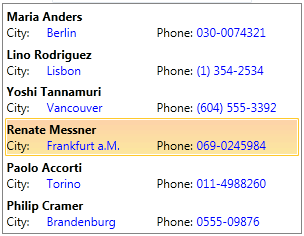
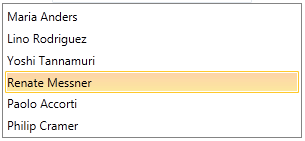

# Binding To Object

To bind the __RadListBox__ to a collection of business objects, you should use its __ItemsSource__ property and define the __DataTemplate__ that is needed to display the data from the collection. If you want the changes to the collection to be automatically reflected to the __RadListBoxItems__, the collection should implement the __INotifyCollectionChanged__ interface, as well as your business object to implement the __INotifyPropertyChanged__ interface.		

The following tutorial will guide you how to bind a __RadListBox__ to a collection of business objects. Two cases will be shown:

* [Using custom ItemTemplate](#using-custom-itemtemplate)

* [Using DisplayMemberPath property](#using-displaymemberpath)

>tip Before reading this tutorial you should get familiar with the [Data Binding]() support of the RadListBox control.

In order to bind a __RadListBox__ to a collection of business objects, you should perform the following instructions:

* Add a new __RadListBox__ declaration in your XAML:    	

__Declaring RadListBox__

<snippet id='radlistbox-populating-with-data-binding-to-object-block_1-xaml' />

* Create a new business object named Customer. Its structure is shown on the next code-snippet:

__Business object implementation__

<snippet id='radlistbox-populating-with-data-binding-to-object-block_2-cs' />

The __RadListBox__ control will be bound to an ObservableCollection of Customer objects.

* Create a new class named __CustomerViewModel__. In fact, this will be the data source for the listbox. This class has only one purpose - to initialize a collection with sample data.    	

__ViewModel__

<snippet id='radlistbox-populating-with-data-binding-to-object-block_3-cs' />

* Declare the __CustomerViewModel__ as a resource in your XAML:    		

__Declaring the ViewModel as resource__

<snippet id='radlistbox-populating-with-data-binding-to-object-block_4-xaml' />

* Update your __RadListBox__ declaration and its __ItemsSource__ property:    		

__Setting the ItemsSource__

<snippet id='radlistbox-populating-with-data-binding-to-object-block_5-xaml' />

## Using Custom ItemTemplate

* The final step is to create a custom __DataTemplate__ and set it to the __RadListBox__'s __ItemTemplate__ property.

__Declaring the ItemTemplate__

<snippet id='radlistbox-populating-with-data-binding-to-object-block_6-xaml' />

* Update your __RadListBox__ declaration and set its __ItemTemplate__ property like in the example below:           	

__Setting the ItemTemplate__

<snippet id='radlistbox-populating-with-data-binding-to-object-block_7-xaml' />

Run your demo, the end result is shown on the snapshot below:

## Using DisplayMemberPath

Instead of creating a custom __ItemTemplate__, an alternative approach is to use the __DisplayMemberPath__ property. Its purpose is to get or set a path to a value on the source object to serve as the visual representation of the object.	

For example, instead of setting the __ItemTemplate__, set the __RadListBox__'s __DisplayMemberPath__ property to point the Name property of the Customer object.

__Setting the DisplayMemberPath__

<snippet id='radlistbox-populating-with-data-binding-to-object-block_8-xaml' />

The end result is shown on the next snapshot:

>If neither the __DisplayMemberPath__ nor the __ItemTemplate__ are set, then the content of the item would be set to the value returned by the ToString() method of the business object. 

## See Also

 * [Getting Started]()