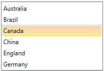

# Declaratively

## 

This tutorial will walk you through the common task of populating __RadListBox__ with __RadListBoxItems__ declaratively.
		

Here is a regular __RadListBox__ declaration without items:

#### __XAML__

{{region radlistbox-populating-with-data-declaratively_0}}
	<telerik:RadListBox  Width="200">			
	</telerik:RadListBox>
	{{endregion}}

In order to add listbox items you need to use the __RadListBox__'s __Items__ property. The Items property is an ItemCollection which contains your __RadListBoxItems__. For example, insert the following lines to the declaration of your __RadListBox__ and see how it will change.
        

#### __XAML__

{{region radlistbox-populating-with-data-declaratively_1}}
	<telerik:RadListBox  Width="200">
		<telerik:RadListBoxItem Content="Australia" />
		<telerik:RadListBoxItem Content="Brazil" />
		<telerik:RadListBoxItem Content="Canada" />
		<telerik:RadListBoxItem Content="China" />
		<telerik:RadListBoxItem Content="England" />
		<telerik:RadListBoxItem Content="Germany" />
	</telerik:RadListBox>
	{{endregion}}

