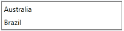

# In Code Behind

This tutorial will walk you through the common tasks of adding and removing __RadListBoxItems__ programmatically.	

__Example 1: RadListBox without Items__

<snippet id='radlistbox-populating-with-data-in-code-behind-block_1-xaml' />

## Adding RadListBoxItems

In order to add items to a __RadListBox__, you can create new __RadListBoxItems__ and add them to the __Items__ collection of the control.

__Example 2: Populating RadListBox with items from code-behind__

<snippet id='radlistbox-populating-with-data-in-code-behind-block_2-cs' />

#### __Figure 1: RadListBox populated in code__

## Removing RadListBoxItems

In order to remove a specific __RadListBoxItem__, you should remove it from the __RadListBox__'s __Items__ collection.

__Example 3: Removing RadListBoxItems__
<snippet id='radlistbox-populating-with-data-in-code-behind-block_3-cs' />

## See Also

* [Getting Started]()