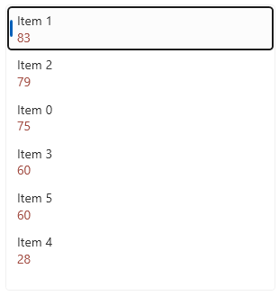

# Sorting

The data in the ListBox control can be sorted using few approaches. 

The most basic sorting method that can be utilized is to manually sort the original collection assigned to the `ItemsSource` of the `RadListBox` control. This will re-order the items in the view. 

An easier approach would be to use `ICollectionView` implementation that works with sort, group and filter descriptors. One possible collection type that can be used is the Telerik's [QueryableCollectionView]() which implements `ICollectionView`. The following example shows how to setup `RadListBox` and sort it by a property of the item model, using the `SortDescriptors` of the collection view.

1. Create the item model.

	__Defining the item model__
	```C#	
		public class ItemInfo : ViewModelBase
		{
			private double number;

			public double Number
			{
				get { return number; }
				set { this.number = value; OnPropertyChanged("Number"); }
			}

			public string Label { get; set; }
		}
	```

1. Define the data and the QueryableCollectionView. The `SortDescriptor` added in the `SortDescriptors` collection tells which property should be used to sort the data. Multiple descriptors can be added to the collection.

	__Setting up the data__
	```C#	
		public MainWindow()
        	{            
            		InitializeComponent();
			
			var r = new Random(0);
            		var source = new ObservableCollection<ItemInfo>();            
            		for (int i = 0; i < 6; i++)
            		{
                		source.Add(new ItemInfo() { Label = "Item " + i, Number = r.Next(10, 100) });
            		}

            		var qcv = new QueryableCollectionView(source);            
            		qcv.SortDescriptors.Add(new SortDescriptor() { Member = "Number", SortDirection = ListSortDirection.Descending });
            		this.listBox.ItemsSource = qcv;
        	}
	```

1. Setup the RadListBox.

	__Setting up the view__
	```XAML	
		<telerik:RadListBox x:Name="listBox">
			<telerik:RadListBox.ItemTemplate>
				<DataTemplate>
					<StackPanel>
						<TextBlock Text="{Binding Label}" FontSize="14" />
						<TextBlock Text="{Binding Number}" Foreground="#A24B40"/>
					</StackPanel>
				</DataTemplate>
			</telerik:RadListBox.ItemTemplate>
		</telerik:RadListBox>
	```

__Sorted RadListBox__



The `QueryableCollectionView` doesn't support live sorting. This means that the order of the items won't change automatically when a value of the property by which the view is sorted changes. To update the view, the `Reset` method of the sort descriptors should be called.

__Resetting the SortDescriptors__
```C#	
	source[0].Number = -20;
	this.queryableCollectionView.SortDescriptors.Reset();
```

The following section shows how to use live sorting without the need to manually reset any descriptors. This can be done using the [ListCollectionView](https://learn.microsoft.com/en-us/dotnet/api/system.windows.data.listcollectionview?view=windowsdesktop-7.0) class.

## Live Sorting

To enable live sorting, a collection type that supports such functionality should be used. For example, the [ListCollectionView](https://learn.microsoft.com/en-us/dotnet/api/system.windows.data.listcollectionview?view=windowsdesktop-7.0) allows this after setting its `IsLiveSorting` property to `true`.

Compared to the `QueryableCollectionView`, the `ListCollectionView` has a collection named __SortDescriptions__, instead of __SortDescriptors__. This collection view type works with `SortDescription` objects.

__Setting up ListCollectionView to support live sorting__
```C#
	public MainWindow()
	{            
		InitializeComponent();
		var source = new ObservableCollection<ItemInfo>();
		for (int i = 0; i < 6; i++)
		{
			source.Add(new ItemInfo() { Label = "Item " + i, Number = r.Next(10, 100) });
		}

		var lcv = new ListCollectionView(source);
		lcv.IsLiveSorting = true;
		lcv.SortDescriptions.Add(new SortDescription("Number", ListSortDirection.Descending));
		this.DataContext = lcv;
	}
```

## See Also  
* [Grouping]()
* [ViewModelBase]()
* [Get Started with UI for WPF]()
