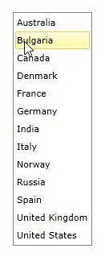
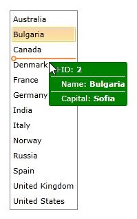

# How to customize the DragVisualProvider

In __RadListBox__ it is possible to enrich the drag-drop functionality of the control by creating a custom __DragVisualProvider__ or using one of the built-in DragVisualProviders. More information about the built-in DragVisualProviders could be found [here]().
      

## Custom DragVisualProvider

The next example will demonstrate the how to create a custom DragVisualProvider in order to change its __Foreground__, __Background__, __BorderBrush__ and __Template__.

>Before proceeding with this example you should get familiar with [Drag and Drop: Overview](), [Implicit Styles]() and [Binding To Object]().
          

1. First you will need to create a __Country__ class with the necessary properties:
            

#### __C#__

{{region radlistbox-styles-and-templates-customize-the-dragvisualprovider-0}}
	public class Country
	{
		public string Name { get; set; }
	
		public string Capital { get; set; }
	
		public int Id { get; set; }
	} 
	{{endregion}}

1. Next you should create a __Countries__ collection in your ViewModel and populate it with some sample data:
            

#### __C#__

{{region radlistbox-styles-and-templates-customize-the-dragvisualprovider-1}}
	public class ViewModel : ViewModelBase
	{
		private ObservableCollection<Country> countries;
	
		public ViewModel()
		{
			this.countries = new ObservableCollection<Country>()
			{
				new Country() { Name = "Australia", Capital = "Canberra", Id = 1 },
				new Country() { Name = "Bulgaria", Capital = "Sofia", Id = 2 },
				new Country() { Name = "Canada", Capital = "Ottawa", Id = 3 },
				new Country() { Name = "Denmark", Capital = "Copenhagen", Id = 4 },
				new Country() { Name = "France", Capital = "Paris", Id = 5 },
				new Country() { Name = "Germany", Capital = "Berlin", Id = 6 },
				new Country() { Name = "India", Capital = "New Delhi", Id = 7 },
				new Country() { Name = "Italy", Capital = "Rome", Id = 8 },
				new Country() { Name = "Norway", Capital = "Oslo", Id = 9 },
				new Country() { Name = "Russia", Capital = "Moscow", Id = 10 },
				new Country() { Name = "Spain ", Capital = "Madrid", Id = 11 },
				new Country() { Name = "United Kingdom", Capital = "London", Id = 12 },
				new Country() { Name = "United States", Capital = "Washington, D.C.", Id = 13 }
			};
		}
	
		public ObservableCollection<Country> Countries
		{
			get
			{
				return this.countries;
			}
	
			set
			{
				if (this.countries != value)
				{
					this.countries = value;
					this.OnPropertyChanged(() => this.Countries);
				}
			}
		}
	}
	{{endregion}}

1. In the App.xaml file merge the necessary __ResourceDictionary__ for the RadListBox control based on the theme you are using. This example uses the Office_Black theme:
            

#### __XAML__

{{region radlistbox-styles-and-templates-customize-the-dragvisualprovider-0}}
	<Application.Resources>
		<ResourceDictionary>
			<ResourceDictionary.MergedDictionaries>
				<ResourceDictionary Source="/Telerik.Windows.Themes.Office_Black;component/Themes/System.Windows.xaml"/>
				<ResourceDictionary Source="/Telerik.Windows.Themes.Office_Black;component/Themes/Telerik.Windows.Controls.xaml"/>
			</ResourceDictionary.MergedDictionaries>
		</ResourceDictionary>
	</Application.Resources>
	{{endregion}}

1. Next you will need to create a Style in the same file that targets __ListBoxDragVisual__ and set its Foreground, Background, BorderBrush and Template properties:
            

#### __XAML__

{{region radlistbox-styles-and-templates-customize-the-dragvisualprovider-1}}
	<Application.Resources>
	    <ResourceDictionary>
	        <ResourceDictionary.MergedDictionaries>
	            ...
	        </ResourceDictionary.MergedDictionaries>
	        
	    </ResourceDictionary>
	</Application.Resources>
	{{endregion}}

You can find the entire ListBoxDragVisual Template code in each specific theme for the RadListBox control.
            

>The custom __DragVisualStyle__ must be created in the App.xaml file as the __DragVisualProvider__ is placed
                inside of another visual tree and cannot be targeted from the Page/Window where RadListBox is placed.
              

1. Finally you will need to declare the __RadListBox__ control. The xaml of the control should look like this:
            

#### __XAML__

{{region radlistbox-styles-and-templates-customize-the-dragvisualprovider-2}}
	<telerik:RadListBox ItemsSource="{Binding Countries}" 
						DisplayMemberPath="Name">
		<telerik:RadListBox.DragDropBehavior>
			<telerik:ListBoxDragDropBehavior AllowReorder="True" />
		</telerik:RadListBox.DragDropBehavior>
		<telerik:RadListBox.DragVisualProvider>
			<telerik:ListBoxDragVisualProvider/>
		</telerik:RadListBox.DragVisualProvider>
	</telerik:RadListBox>
	{{endregion}}

>tipYou can download a runnable project of the previous example from our online SDK repository
            [here](https://github.com/telerik/xaml-sdk), the example is listed as __ListBox / CustomDragVisualStyle__.
          

The next screenshots show the final result:
          

# See Also

 * [Overview]()

 * [Drag-Drop between RadListBox and RadScheduleView]()
