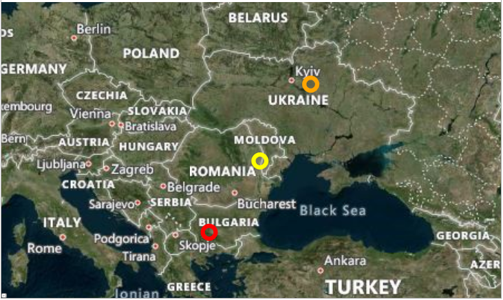

# Changing the Viewport

The viewport of the __Map__ control is the area currently visible within the map's bounds. This area can be controlled by utilizing the `ZoomLevel`, `Zoom`, and `Center` properties of `RadMap`.

#### __[C#] Changing the current viewport__
{{region changing-the-viewport-0}}
    this.RadMap.Zoom = 4.5;
    this.RadMap.Center = new Location(30, 65);
{{endregion}}

#### __[VB.NET] Changing the current viewport__
{{region changing-the-viewport-1}}
    Me.RadMap.Zoom = 4.5
    Me.RadMap.Center = New Location(30, 65)
{{endregion}}

>tip To learn more about these properties, you can refer to the [Zooming](%slug radmap-features-zoom-modes%) and [Navigation](%slug radmap-features-navigation%) articles.

In addition, you can utilize the `SetView` method of the RadMap control. This method exposes two overloads that will allow you to change the currently visible area. 

The first overload will change the viewport, by modifying the `ZoomLevel` and `Center` properties, so that the area provided by the `LocationRect` object is completely visible. The second parameter is of the type `bool` and it indicates whether the zooming should use the fractional part of the calculated zoom level.

#### __[C#] Using the first overload of the SetView method in a Click event__
{{region changing-the-viewport-2}}
    private void RadButton_Click(object sender, RoutedEventArgs e)
    {
        LocationRect usaCoordinates = new LocationRect(
            new Location(50, -120),
            new Location(30, -70));

        this.RadMap.SetView(usaCoordinates, true);
    }
{{endregion}}

#### __[VB.NET] Using the first overload of the SetView method in a Click event__
{{region changing-the-viewport-3}}
    Private Sub RadButton_Click(ByVal sender As Object, ByVal e As RoutedEventArgs)
        Dim usaCoordinates As LocationRect = New LocationRect(
            New Location(50, -120),
            New Location(30, -70))
        
        Me.RadMap.SetView(usaCoordinates, true)
    End Sub
{{endregion}}

The second overload of the method allows you to specify a minimum padding that will be applied to the `LocationRect` object (visible view). The passed value will apply this padding in pixels, rather than kilometers or miles.

#### __[C#] Using the second overload of the SetView method in a Click event__
{{region changing-the-viewport-4}}
    private void RadButton_Click(object sender, RoutedEventArgs e)
    {
        LocationRect usaCoordinates = new LocationRect(
            new Location(50, -120),
            new Location(30, -70));

        this.RadMap.SetView(usaCoordinates, 300);
    }
{{endregion}}

#### __[VB.NET] Using the second overload of the SetView method in a Click event__
{{region changing-the-viewport-5}}
    Private Sub RadButton_Click(ByVal sender As Object, ByVal e As RoutedEventArgs)
        Dim usaCoordinates As LocationRect = New LocationRect(
            New Location(50, -120),
            New Location(30, -70))
        
        Me.RadMap.SetView(usaCoordinates, 300)
    End Sub
{{endregion}}

## Setting the Best View

If you have a set of elements displayed by the `VisualizationLayer`, you might want to display all of them in the visible area of the map and to set the optimal zoom for them. This can be done by using the best view feature of the `RadMap` control. To use it, call the `GetBestView` method of the `VisualizationLayer` and pass its items to it. This method will return a `LocationRect` object which represents the best view for the items. You can use it in order to adjust the `RadMap` center and zoom level.

#### __[C#] Setting the Best View of the RadMap control__
{{region changing-the-viewport-6}}
    private void SetBestView()
	{
	    LocationRect rect = this.visualizationLayer.GetBestView(this.visualizationLayer.Items.Cast<object>());
	    
        this.RadMap.SetView(rect, 300);
	}
{{endregion}}

#### __[VB.NET] Setting the Best View of the RadMap control__
{{region changing-the-viewport-7}}
    Private Sub SetBestView()
        Dim rect As LocationRect = Me.visualizationLayer.GetBestView(Me.visualizationLayer.Items.Cast(Of Object)())

        Me.RadMap.SetView(rect, 300)
    End Sub
{{endregion}}

__Result of the execution of the above code:__

