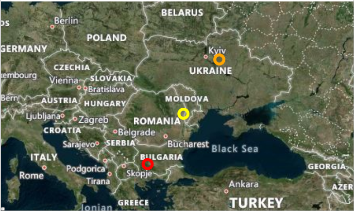

# Changing the Viewport

The viewport of the __Map__ control is the area currently visible within the map's bounds. This area can be controlled by utilizing the `ZoomLevel`, `Zoom`, and `Center` properties of `RadMap`.

__Changing the current viewport__
<snippet id='radmap-features-changing-the-viewport-block_1-cs' />
<snippet id='radmap-features-changing-the-viewport-block_1-vb' />

>tip To learn more about these properties, you can refer to the [Zooming](%slug radmap-features-zoom-modes%) and [Navigation](%slug radmap-features-navigation%) articles.

In addition, you can utilize the `SetView` method of the RadMap control. This method exposes two overloads that will allow you to change the currently visible area. 

The first overload will change the viewport, by modifying the `ZoomLevel` and `Center` properties, so that the area provided by the `LocationRect` object is completely visible. The second parameter is of the type `bool` and it indicates whether the zooming should use the fractional part of the calculated zoom level.

__Using the first overload of the SetView method in a Click event__
<snippet id='radmap-features-changing-the-viewport-block_2-cs' />
<snippet id='radmap-features-changing-the-viewport-block_2-vb' />

The second overload of the method allows you to specify a minimum padding that will be applied to the `LocationRect` object (visible view). The passed value will apply this padding in pixels, rather than kilometers or miles.

__Using the second overload of the SetView method in a Click event__
<snippet id='radmap-features-changing-the-viewport-block_3-cs' />
<snippet id='radmap-features-changing-the-viewport-block_3-vb' />

## Setting the Best View

If you have a set of elements displayed by the `VisualizationLayer`, you might want to display all of them in the visible area of the map and to set the optimal zoom for them. This can be done by using the best view feature of the `RadMap` control. To use it, call the `GetBestView` method of the `VisualizationLayer` and pass its items to it. This method will return a `LocationRect` object which represents the best view for the items. You can use it in order to adjust the `RadMap` center and zoom level.

__Setting the Best View of the RadMap control__  
<snippet id='radmap-features-changing-the-viewport-block_4-cs' />
<snippet id='radmap-features-changing-the-viewport-block_4-vb' />

__Result of the execution of the above code:__

