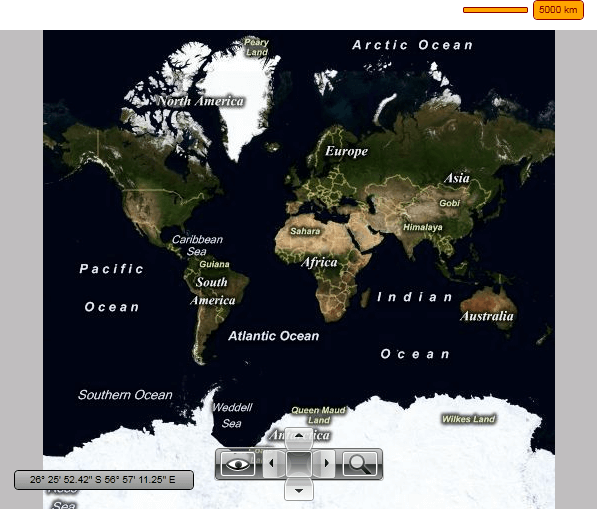

# Distance and Scale

The __RadMap__ uses two measure units for distance - mile and kilometer. The measure units are need for the placement of the __MapShapes__, as their width and height are measured in the selected unit. To choose the most suitable unit you have to set the __DistanceUnit__ property of the __RadMap__.        

>The default DistanceUnit is __Kilometer__.          


```XAML
	<telerik:RadMap x:Name="radMap"
	                DistanceUnit="Mile" />
```

The __DistanceUnit__ also affects the __Scale__ control displayed at the lower right corner of the __RadMap__.       

If you want to hide it, you just have to set the __ScaleVisibility__ property to __False__.        


```XAML
	<telerik:RadMap x:Name="radMap"
	                ScaleVisibility="Collapsed" />
```

The UI control is represented by the __MapScale__ control. You are able to use it outside the __RadMap__ and place it somewhere around it. In this case you have to either hide the original one by using the __ScaleVisibility__ property of the __RadMap__ or the __UseDefaultLayout__ one.        

>tip Setting the __UseDefaultLayout__ property to __False__ will hide all of the UI controls inside the __RadMap__. To learn more read [here]().        

In order to use the __MapScale__ outside the __RadMap__ you have to set its __MapControl__ property to the respective __RadMap__ instance. Additionally you can modify its appearance. 

Here is an example:        

>When using an outside __MapScale__ control, it's the value of the __DistanceUnit__ property of this control that will be counted, not the one of the __RadMap's__ __DistanceUnit__ property.          


```XAML
	<StackPanel>
	    <telerik:MapScale MapControl="{Binding ElementName=radMap}"
	                        ScaleLabelBackground="Orange"
	                        ScaleLabelBorderBrush="DarkRed"
	                        BorderBrush="DarkRed"
	                        Background="Orange"
	                        Foreground="DarkRed"
	                        HorizontalAlignment="Right"
	                        Margin="10"
	                        DistanceUnit="Kilometer" />
	    <telerik:RadMap x:Name="radMap"
	                    Width="600"
	                    Height="480"
	                    ScaleVisibility="Collapsed" />
	</StackPanel>
```

Here is a snapshot of the result:



## See Also
 * [Navigation]()
 * [Click Modes]()
 * [Zoom Modes]()
 * [Mouse Location]()
 * [Default Layout]()