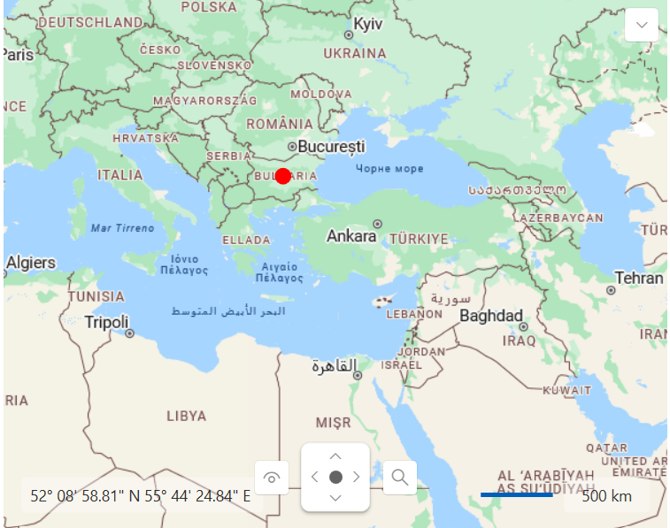
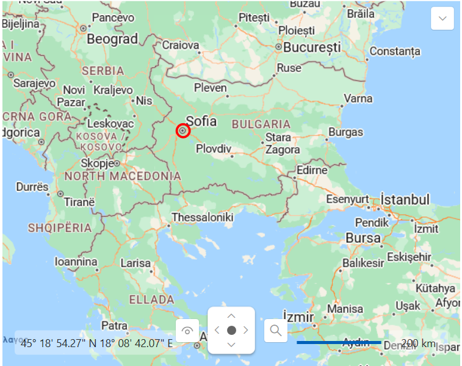

# Dynamic Layer

In contrast to __InformationLayer__ which processes all items in a collection, the __DynamicLayer__ requests items to process. It makes favour when thousands of items are available (pictures of POIs, for example). Your application can select what pictures are suitable for given location and zoom factor and return only these ones.      

>tip This allows you to implement items virtualization. It means that framework elements, pin points and map shapes are loaded when the region of the map they belong to is visible.        

The __DynamicLayer__ uses a request to get items to show when zoom or center property is changed and refreshes items collection every time when response contains new data. It also supports asynchronous requests, so that new items can be downloaded from the server only when they come into view.      

This topic will explain the following:

* [Map Division](#map-division)

* [Dynamic Source](#dynamic-source)

## Map Division

The __DynamicLayer__ requires a division of the map space in regions. The division of map space is defined using the __DynamicLayer.ZoomGridList__ collection. Each __ZoomGrid__ should define a minimum zoom level for its division. Of course the maximum zoom level for a grid is the minimum zoom layer of the next grid in the list. Also each zoom level is divided in a grid of latitude/longitude divisions.        

Here is an example of a __DynamicLayer__ with a set of two __ZoomGrids__:        

<snippet id='radmap-features-dynamic-layer-block_1-xaml' />

There are two grid lists - the one goes from zoom 3 to 6, and the other from zoom 6 to the maximum zoom. Also, the first grid has a 2 by 2 latitude/longitude division. This means that map is divided in 4 regions, and the layer only requests data for the current visible regions. The second slice is divided into 16 regions - higher zoom values require more divisions to perform well.        

## Dynamic Source

The data provided to the __DynamicLayer__ should be wrapped in a class that implements the __IMapDynamicSource__ interface. This interface contains the __ItemsRequest()__ method, which is used by the __DynamicLayer__ to make request for new data, whenever the zoom level or the region changes.        

>When there are no __ZoomGrids__ that satisfy the current zoom level, no request would be made. Also when the changed value of the zoom level or the regionstays in the range of a __ZoomGrid__ or one of it cells, no request is made neither. In the current case, for example, when the zoomlevel is 1 or 2, no requests would be made, because there is no grid which represent this range. When the value is bigger than 6, requests would be made only when the grid cell changes, because the gird is defined for the range from 6 to the maximal zoom level.          

The following properties are used in the __ItemsRequest()__ method from the __DynamicLayer__:        

* __minZoom__ - represents the minimum zoom level of the currently active __ZoomGrid__.            

* __upperLeft__ - represents the upper left corner of the currently visible region.            

* __lowerRight__ - represents the lower right corner of the currently visible region.            

* __CompleteItemsRequest__ - represents an __Action__, which is responsible to pass the desired item back to the __DynamicLayer__.            

In this method you have to implement your logic for getting the desired items. The items can be represented by static and dynamic data as well. Here is an example of how to implement simple static functionality in the __ItemsRequest()__ method.        

>If you want to deliver your data via a WebService you can follow our [demo](https://demos.telerik.com/silverlight/#Map/DynamicLayer) with full source code.          

<snippet id='radmap-features-dynamic-layer-block_2-cs' />
<snippet id='radmap-features-dynamic-layer-block_2-vb' />

You can set the dynamic source to a new instance of the MapDynamicSource and create a new definition for the AzureMapProvider:        

<snippet id='radmap-features-dynamic-layer-block_3-cs' />
<snippet id='radmap-features-dynamic-layer-block_3-vb' />

The result:

ZoomLevel = 3:

ZoomLevel = 6:

## See Also
 * [Information Layer]()
 * [Data Binding]()
 * [KML Data Import]()