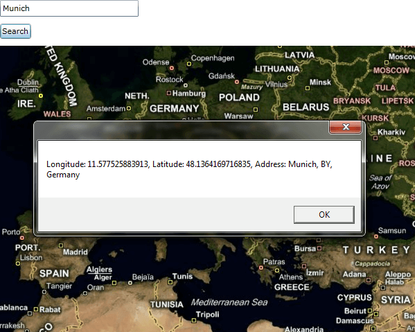

# Geocode

The __RadMap__ provides unified geocoding architecture,
        which uses the functionality of the different geocoding services. This allows
        you to easily convert a location point to an address and the opposite -
        address to a location point.
      

This topic will focus on the following:

* [Geocode Providers](#Geocode_Providers)

* [Using BingGeocodeProvider](#Using_BingGeocodeProvider)

* [Geocode and Reverse Geocode](#Geocode_and_Reverse_Geocode)

* [Results](#Results)

## Geocode Providers

The __Geocode Providers__ are very similar to the
          __Map Providers__. They make calls to the
          respective services in order to provide a certain functionality.
        

Here is a list of the currently available geocode providers:

* __BingGeocodeProvider__ - allows you to perform
              geocode actions via the __Bing Maps__.
            

## Using BingGeocodeProvider

In order to use the __BingGeocodeProvider__ you have to
          create an instance of it and handle its __GeocodeCompleted__
          event. Also you have to set the following properties:
        

* __ApplicationId__ - this represents a key, which allows
            you to use the __Bing Maps__ services. It should be the
            same key as the one you use with the __BingMapProvider__ class.
            

>Without supplying a valid key you won't be able to visualize the map
                inside the __RadMap__ control. In order to learn
                how to obtain one, please read [this article](http://msdn.microsoft.com/en-us/library/ee681900.aspx).
              

* __MapControl__ - represents the instance of the
              __RadMap__, which should be associated with the geocode provider.
            

Here is an example:

#### __C#__

{{region radmap-features-geocode_0}}
	BingGeocodeProvider geocodeProvider;
	public Sample()
	{
	    InitializeComponent();
	    this.geocodeProvider = new BingGeocodeProvider();
	    this.geocodeProvider.ApplicationId = "key";
	    this.geocodeProvider.MapControl = this.radMap;
	    this.geocodeProvider.GeocodeCompleted += this.geocodeProvider_GeocodeCompleted;
	}
	private void geocodeProvider_GeocodeCompleted( object sender, GeocodeCompletedEventArgs e )
	{
	}
	{{endregion}}

#### __VB.NET__

{{region radmap-features-geocode_1}}
	Private geocodeProvider As BingGeocodeProvider
	Public Sub New()
	 InitializeComponent()
	 Me.geocodeProvider = New BingGeocodeProvider()
	 Me.geocodeProvider.ApplicationId = "key"
	 AddHandler Me.geocodeProvider.GeocodeCompleted, AddressOf Me.geocodeProvider_GeocodeCompleted
	End Sub
	Private Sub geocodeProvider_GeocodeCompleted(sender As Object, e As GeocodeCompletedEventArgs)
	End Sub
	{{endregion}}

## Geocode and Reverse Geocode

The __Geocode__ feature allows you to perform both
          location to address and address to location conversion. This allows you
          to provide the user with the specific address of a location he/she has chosen,
          or provide him/her with coordinates of the address he/she is interested in.
        

## Geocode

If you want to convert an address to a location you have to call the
          __GeocodeAsync()__ method of the
          __BingGeocodeProvider__ and pass a
          __GeocodeRequest__ to it. The
          __GeocodeRequest__ should contain the desired address,
          which to get converted to a location point.
        

For example, you can use an UI that consists of a __TextBox__
          named "__InputBox__" and a button, upon which click
          a geocode action should be executed.
        

#### __XAML__

{{region radmap-features-geocode_2}}
	<StackPanel Width="600"
	            Height="480">
	    <TextBox x:Name="InputBox"
	                Margin="0,0,0,10"
	                Width="200"
	                HorizontalAlignment="Left" />
	    <Button x:Name="GeocodeButton"
	            Content="Search"
	            Click="GeocodeButton_Click"
	            Margin="0,0,0,10"
	            HorizontalAlignment="Left" />
	    <telerik:RadMap x:Name="radMap" />
	</StackPanel>
	{{endregion}}

Here is how the code for the button's __Click__
          event handler should look.
        

>tipThis is very similar to the usage of the __SearchRequest__,
            so you are able to provide the user with an input box in order to enter the desired address.
          

#### __C#__

{{region radmap-features-geocode_3}}
	private void GeocodeButton_Click( object sender, RoutedEventArgs e )
	{
	    GeocodeRequest request = new GeocodeRequest();
	    request.Query = this.InputBox.Text;
	    this.geocodeProvider.GeocodeAsync( request );
	}
	{{endregion}}

#### __VB.NET__

{{region radmap-features-geocode_4}}
	Private Sub GeocodeButton_Click(sender As Object, e As RoutedEventArgs)
	 Dim request As New GeocodeRequest()
	 request.Query = Me.InputBox.Text
	 Me.geocodeProvider.GeocodeAsync(request)
	End Sub
	{{endregion}}

## Reverse Geocode

If you want to convert a location point to an address you have to
          call the __ReverseGeocodeAsync()__ method of
          the __BingGeocodeProvider__ and pass a
          __ReverseGeocodeRequest__ to it. The
          __GeocodeRequest__ should contain the
          desired location, which to be converted to an address.
        

For example, you can use the __MapMouseDoubleClick__
          event to implement a logic that executes a reverse geocode action.
          In this way the user would be able to get the address of the
          location, he had clicked.
        

>tipYou can find more information about the __Map Double Click__ feature
            [here]().
          

#### __XAML__

{{region radmap-features-geocode_5}}
	<telerik:RadMap x:Name="radMap"
	                MapMouseDoubleClick="radMap_MapMouseDoubleClick"
	                MouseDoubleClickMode="None" />
	{{endregion}}

Here is how the code for the __MapMouseDoubleClick__
          event handler should look like.
        

#### __C#__

{{region radmap-features-geocode_6}}
	private void radMap_MapMouseDoubleClick( object sender, MapMouseRoutedEventArgs e )
	{
	    ReverseGeocodeRequest reverseRequest = new ReverseGeocodeRequest();
	    reverseRequest.Location = e.Location;
	    this.geocodeProvider.ReverseGeocodeAsync( reverseRequest );
	}
	{{endregion}}

#### __VB.NET__

{{region radmap-features-geocode_7}}
	Private Sub radMap_MapMouseDoubleClick(sender As Object, e As MapMouseRoutedEventArgs)
	 Dim reverseRequest As New ReverseGeocodeRequest()
	 reverseRequest.Location = e.Location
	 Me.geocodeProvider.ReverseGeocodeAsync(reverseRequest)
	End Sub
	{{endregion}}

## Results

The results from the geocode services are held by the
          __GeocodeResponse__ object inside the
          __GeocodeCompletedEventArgs__ of the handler
          for the __GeocodeCompleted__ event.
          In case you are using reverse geocode, you will most certainly get only one result.
          If you use normal geocode, you can get more than one result,
          depending on the exactness of the query.
        

>tipIf you need more information you can take a look at the
            [GeocodeResponse](http://www.telerik.com/help/silverlight/t_telerik_windows_controls_map_geocoderesponse.html)
            and
            [GeocodeResult](http://www.telerik.com/help/silverlight/t_telerik_windows_controls_map_geocoderesult.html)
            classes in the API Reference.
          

To get the results you have to simply iterate the collection. Here is an
          example, which shows a __MessageBox__ for each result.
        

#### __C#__

{{region radmap-features-geocode_8}}
	private void geocodeProvider_GeocodeCompleted( object sender, GeocodeCompletedEventArgs e )
	{
	    foreach ( GeocodeResult result in e.Response.Results )
	    {
	        MessageBox.Show( string.Format( "Longitude: {0}, Latitude: {1}, Address: {2}", result.Locations.First().Longitude, result.Locations.First().Latitude, result.DisplayName ) );
	    }
	}
	{{endregion}}

#### __VB.NET__

{{region radmap-features-geocode_9}}
	Private Sub geocodeProvider_GeocodeCompleted(sender As Object, e As GeocodeCompletedEventArgs)
	 For Each result As GeocodeResult In e.Response.Results
	  MessageBox.Show(String.Format("Longitude: {0}, Latitude: {1}, Address: {2}", result.Locations.First().Longitude, result.Locations.First().Latitude, result.DisplayName))
	 Next
	End Sub
	{{endregion}}

Here is a snapshot of the result.

# See Also

 * [Providers Overview]()

 * [Empty provider]()

 * [Search]()

 * [Routing]()
