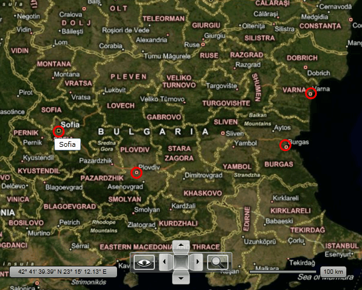

# Data Binding

When displaying a map, you might also want to visualize some data on it in the form of hot spots, pin points, etc. As showed in the topics under the Information Layer section, you can declare them as static objects. However, the __InformationLayer__ object allows you to dynamically load and display map markers via data binding.

>tip To learn more about the __InformationLayer__ class and its usage read [this topic]().

In order to display your map data dynamically you just have to treat the __InformationLayer__ as a typical __ItemsControl__. This means you have to use its __ItemsSource__ and __ItemTemplate__ properties. You can also make a use of the __ItemTemplateSelector__ property, in order to implement advanced visualization depending on the data item.

There are two approaches you can use:

* [Directly bind the appropriate attached properties in the DataTemplate](#using-data-binding-in-the-datatemplate)

* [Use DataMappings](#using-datamappings)

## Using Data Binding in the DataTemplate

When loading your map data dynamically there are several attached properties that you can use in order to position and display the marker on its proper place:

* __MapLayer.Location__ - represents the latitude and the longitude of the map point.

* __MapLayer.BaseZoomLevel__ - represents the zoom level of the map for which the marker should have its normal size.

* __MapLayer.ZoomRange__ - represents a range of zoom levels on which the marker should appear.

>tip To learn more about the usage of these properties read [this topic]().

In order to provide the needed data to your __RadMap__ control, you have to create a collection of business objects, which represent the desired data.

>tip The business object and the sample data for this example can be found at the [end of the topic](#sample_code).

The next step is to define the __ItemTemplate__ for the information layer and set the desired bindings in it. In the current example, the marker will be represented by an ellipse marked as a Hot Spot.


```XAML
	<telerik:RadMap x:Name="radMap"
	                Width="600"
	                Height="480">
	    <telerik:InformationLayer x:Name="informationLayer">
	        <telerik:InformationLayer.ItemTemplate>
	            <DataTemplate>
	                <Grid telerik:MapLayer.BaseZoomLevel="{Binding BaseZoomLevel}"
	                        telerik:MapLayer.Location="{Binding Location}"
	                        telerik:MapLayer.ZoomRange="{Binding ZoomRange}">
	                    <telerik:MapLayer.HotSpot>
	                        <telerik:HotSpot X="0.5"
	                                            Y="0.5"
	                                            ElementName="PART_Ellipse" />
	                    </telerik:MapLayer.HotSpot>
	                    <Ellipse x:Name="PART_Ellipse"
	                                Width="20"
	                                Height="20"
	                                Stroke="Red"
	                                StrokeThickness="3"
	                                Fill="Transparent">
	                        <ToolTipService.ToolTip>
	                            <ToolTip Content="{Binding Caption}" />
	                        </ToolTipService.ToolTip>
	                    </Ellipse>
	                </Grid>
	            </DataTemplate>
	        </telerik:InformationLayer.ItemTemplate>
	    </telerik:InformationLayer>
	</telerik:RadMap>
```

The last thing to do is to set the __ItemsSource__ property of the __InformationLayer__. This has to be done after the initialization of the map provider, otherwise the marker elements will appear before the map has loaded. For this purpose you have to use the __InitializationCompleted__ event, which get raised after the initialization of the map provider completes.

>tip The code for the __GetMapData()__ method can be found at the [end of the topic](#sample_code).


```C#
	public DataBindingSample()
	{
	    InitializeComponent();
	    this.radMap.InitializeCompleted += radMap_InitializeCompleted;            
	}
	void radMap_InitializeCompleted( object sender, EventArgs e )
	{
	    this.informationLayer.ItemsSource = this.GetMapData();
	}
```
```VB.NET
	Public Sub New()
	 InitializeComponent()
	 Me.radMap.InitializeCompleted += radMap_InitializeCompleted
	End Sub
	Private Sub radMap_InitializeCompleted(sender As Object, e As EventArgs)
	 Me.informationLayer.ItemsSource = Me.GetMapData()
	End Sub
```

As a result you should be able to see the markers on your __RadMap__.



## Using DataMappings

By using this approach you have to define mappings between the data fields and the respective __MapLayer__ properties. This is done by creating the respective __DataMapping__ objects and adding them to the __DataMappings__ collection of the __InformationLayer__.

>tip The __DataMember__ enumeration used for the ValueMember value allows you to map not only the __Location__, __ZoomLevel__ and __ZoomRange__. You can also map __Latitude__, __Longitude__, __ZoomRangeMin__ and __ZoomRangeMax__. Which means that your business object can provide simple double properties for these values instead of the complex __Location__ and __ZoomRange__ ones.

>In this example, the same __ItemTemplate__, business object and sample data will be used as in the example from the previous section of this topic. 

The code for the business object and for the sample data can be found at the [end of the topic](#sample_code).

To learn how and when to set the __ItemsSource__ of the __InformationLayer__, please read [the previous section](#using-data-binding-in-the-datatemplate).


```XAML
	<telerik:RadMap x:Name="radMap"
	                Width="600"
	                Height="480">
	    <telerik:InformationLayer x:Name="informationLayer">
	        <telerik:InformationLayer.DataMappings>
	            <telerik:DataMapping FieldName="Location"
	                                    ValueMember="Location" />
	            <telerik:DataMapping FieldName="BaseZoomLevel"
	                                    ValueMember="ZoomLevel" />
	            <telerik:DataMapping FieldName="ZoomRange"
	                                    ValueMember="ZoomRange" />
	        </telerik:InformationLayer.DataMappings>
	        <telerik:InformationLayer.ItemTemplate>
	            <DataTemplate>
	                <Grid>
	                    <telerik:MapLayer.HotSpot>
	                        <telerik:HotSpot X="0.5"
	                                            Y="0.5"
	                                            ElementName="PART_Ellipse" />
	                    </telerik:MapLayer.HotSpot>
	                    <Ellipse x:Name="PART_Ellipse"
	                                Width="20"
	                                Height="20"
	                                Stroke="Red"
	                                StrokeThickness="3"
	                                Fill="Transparent">
	                        <ToolTipService.ToolTip>
	                            <ToolTip Content="{Binding Caption}" />
	                        </ToolTipService.ToolTip>
	                    </Ellipse>
	                </Grid>
	            </DataTemplate>
	        </telerik:InformationLayer.ItemTemplate>
	    </telerik:InformationLayer>
	</telerik:RadMap>
```

Finally here is the code for the business object and the __GetMapData()__ method.


```C#
	public class MapItem
	{
	    public MapItem( string caption, Location location, double baseZoomLevel, ZoomRange zoomRange )
	    {
	        this.Caption = caption;
	        this.Location = location;
	        this.BaseZoomLevel = baseZoomLevel;
	        this.ZoomRange = zoomRange;
	    }
	    public string Caption
	    {
	        get;
	        set;
	    }
	    public Location Location
	    {
	        get;
	        set;
	    }
	    public double BaseZoomLevel
	    {
	        get;
	        set;
	    }
	    public ZoomRange ZoomRange
	    {
	        get;
	        set;
	    }
	}
```
```VB.NET
	Public Class MapItem
	 Public Sub New(caption As String, location As Location, baseZoomLevel As Double, zoomRange As ZoomRange)
	  Me.Caption = caption
	  Me.Location = location
	  Me.BaseZoomLevel = baseZoomLevel
	  Me.ZoomRange = zoomRange
	 End Sub
	 Public Property Caption() As String
	  Get
	   Return m_Caption
	  End Get
	  Set
	   m_Caption = Value
	  End Set
	 End Property
	 Private m_Caption As String
	 Public Property Location() As Location
	  Get
	   Return m_Location
	  End Get
	  Set
	   m_Location = Value
	  End Set
	 End Property
	 Private m_Location As Location
	 Public Property BaseZoomLevel() As Double
	  Get
	   Return m_BaseZoomLevel
	  End Get
	  Set
	   m_BaseZoomLevel = Value
	  End Set
	 End Property
	 Private m_BaseZoomLevel As Double
	 Public Property ZoomRange() As ZoomRange
	  Get
	   Return m_ZoomRange
	  End Get
	  Set
	   m_ZoomRange = Value
	  End Set
	 End Property
	 Private m_ZoomRange As ZoomRange
	End Class
```


```C#
	private ObservableCollection<MapItem> GetMapData()
	{
	    ObservableCollection<MapItem> data = new ObservableCollection<MapItem>();
	    data.Add( new MapItem( "Sofia", new Location( 42.6957539183824, 23.3327663758679 ), 5, new ZoomRange( 5, 12 ) ) );
	    data.Add( new MapItem( "Plovdiv", new Location( 42.1429369264591, 24.7498095849434 ), 5, new ZoomRange( 5, 12 ) ) );
	    data.Add( new MapItem( "Burgas", new Location( 42.5131732087098, 27.4611884843576 ), 5, new ZoomRange( 5, 12 ) ) );
	    data.Add( new MapItem( "Varna", new Location( 43.2073941930888, 27.9275176988258 ), 5, new ZoomRange( 5, 12 ) ) );
	    return data;
	}
```
```VB.NET
	Private Function GetMapData() As ObservableCollection(Of MapItem)
	 Dim data As New ObservableCollection(Of MapItem)()
	 data.Add(New MapItem("Sofia", New Location(42.6957539183824, 23.3327663758679), 5, New ZoomRange(5, 12)))
	 data.Add(New MapItem("Plovdiv", New Location(42.1429369264591, 24.7498095849434), 5, New ZoomRange(5, 12)))
	 data.Add(New MapItem("Burgas", New Location(42.5131732087098, 27.4611884843576), 5, New ZoomRange(5, 12)))
	 data.Add(New MapItem("Varna", New Location(43.2073941930888, 27.9275176988258), 5, New ZoomRange(5, 12)))
	 Return data
	End Function
```

## See Also
 * [Getting Started]()
 * [Information Layer]()
 * [Hot Spots]()